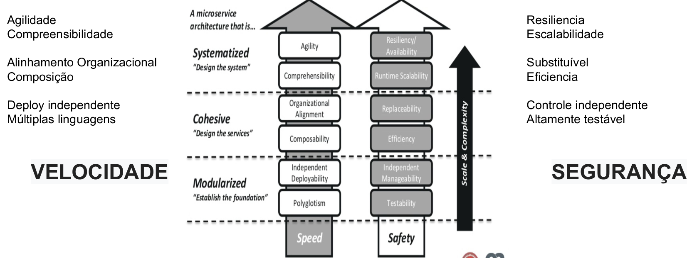

## Características Microsserviços
   > Nesta seção falaremos um pouco sobre tudo que engloba os microsserviços, suas principais características, forma de implementar e o que torna um microserviço tão especial.
   > Iniciou em 2011 com a Netflix com a mudança de paradgima da empresa

### Características
   * Um conjunto de pequenos autônomos que trabalham juntos. "Newman, Sam"
   * Software modularizado em pequenos serviços que se comunicam através de uma forma padronizada.
   * Se comunicam através de uma API Restfull (HTTP / Json).  

### Características Técnicas   
   * Out-of-process
       * Possibilidade de execução fora dos processos.
   * Chamadas remotas.
       * Microsserviços são acessados por chamadas remotas.
   * Independente de linguagem de programação.
       * São agnósticos a linguagem de programação, ou seja, você pode ter serviços escritos em node, java, python,etc.
   * Baixo acoplamento
       * Você é dono somente do seu domínio de negócio. Não necessitando de outro serviço para gerar novas versões e ou evoluir seu produto.
   * Escalabilidade horizontal e vertical
       * Você pode aumentar o número de réplicas (scale horizontal) e/ou aumentar a capacidade computacional de seu serviço (scale vertical)

### Características Organizacionais
   * Agilidade
       * Trabalhando em conjuntos de negócio menores você garante agilidade no desenvolvimento de software.
   * Equipe pequena e focada.
       * Utilizando o conceito de two-pizzas team você garante foco e produtividade do time de desenvolvimento.
   * Entregas rápidas.
       * Por ser altamente testável, um micro serviço pode estar disponível rapidamente em produção com garantias de segurança e qualidade.
   * Combinação de tecnologias
       * Você é dono somente do seu domínio de negócio. Não necessitando de outro serviço para gerar novas versões e ou evoluir seu produto.
   * Combinação de tecnologias
       * Times podem ser multidisciplinares em tecnologias para desenvolver os microsserviços.

> A arquitetura de micro-serviços coloca cada elemento de funcionalidade em um servio separado...
> ...e escala distribuindo os serviços entre servidores, replicando por demanda.       

### Práticas recomendadas
   * Modele os serviços em torno de domínio da empresa.
   * Descentralize tudo. Equipes individuais são responsáveis por projetar e criar serviços. Evite compartilhar esquemas de dados ou códigos.
   * O armazenamento de dados deve ser privado para o serviço que é o proprietário dos dados. Use o melhor armazenamento para cada serviço e tipo de dados.
   * Os serviços comunicam-se por meio de APIs bem projetadas. Evite o vazamento de detalhes da implementação. As APIs devem modelar o domínio, não a implementação interna do serviço.
   * Evite acoplamento entre serviços. Causas de acoplamento incluem protocolos de comunicação rígidos e esquemas de banco de dados compartilhados.
   * Descarregue preocupações abrangentes, como autenticação e terminação SSL, para o gateway.
   * Mantenha o conhecimento de domínio fora do gateway.
   * Os serviços devem ter um acoplamento flexível e alta coesão funcional. 
   * Isole falhas. Use estratégias de resiliência para impedir que falhas em um serviço distribuam-se em cascata.
   * Evite acoplamento entre serviços. Causas de acoplamento incluem protocolos de comunicação rígidos e esquemas de banco de dados compartilhados.

### Capabilities

   

## Importante
> 'Everything Fails All the Time' Werner Vogels CTO / VP - Amazon

### Falácias
   * The network is reliable (A rede é confiável)
   * Latency is zero (Latência é zero)
   * Bandwidth is infinite (A largura de banda é infinita)
   * The network is secure (A rede é segura)
   * Topology doesn't change (Topologia não muda)
   * There is one administrator (Existe um administrador)
   * Transport cost is zero (Custo de transporte é zero)
   * The network is homogeneous (A rede é homogênea)
