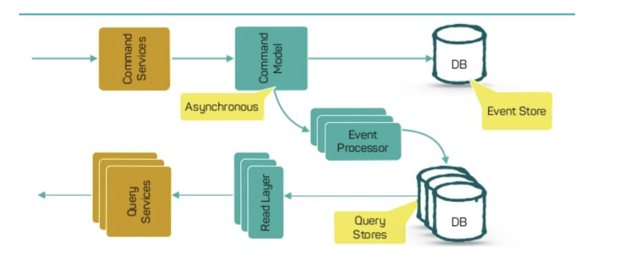

## Design Patterns
   > Quais os padrões mais usados para implementar uma arquitetura de microserviço? Como coreografar chamadas intra-serviços? Nesta seção você aprenderá tudo sobre Design Patterns.

### Aggregator Pattern
   > Você pode abstrair a lógica em microsserviços compostos e agregar essa lógica de negócios específica em um serviço. Portanto, por exemplo, se você considerar dois serviços: Serviços A e B, poderá dimensionar esses serviços individualmente simultaneamente, fornecendo os dados ao microserviço composto.

   

### API Gateway Pattern
> API Gateway Pattern provê uma fachada de acesso para seus clientes. Você esconde seu negócio e só disponibiliza um entrypoint para os clientes preservando sua infra-estrutura e tendo um melhor controle no seu domínio de negócio.

   

### Chain Pattern
> Chain or Chained Pattern se refere a uma cadeia síncrona de requisições entre serviços para atender uma necessidade específica de negócio.
> Um aspecto mais importante que você precisa entender é que a solicitação do Serviço A para o Serviço B pode parecer diferente do Serviço B para o Serviço C. Da mesma forma, a resposta do Serviço C para o Serviço B pode parecer completamente diferente do Serviço B para o Serviço A.

   

### Proxy Pattern
> É uma variação do Agregador. Nesse caso, nenhuma agregação precisa ocorrer no cliente, mas um microsserviço diferente pode ser chamado com base nas necessidades de negócios. Assim como o Agregador, o Proxy também pode ser dimensionado independentemente. Você pode fazer isso onde cada serviço individual não precisa ser exposto ao consumidor e, ao invés vez disso, deve passar por uma interface de acesso.

   

### Event Sourcing Pattern
> Cria eventos relacionados às alterações no estado do aplicativo. Estes eventos são armazenados como uma sequência de eventos para ajudar os desenvolvedores a rastrear quais alterações foram feitas quando. Portanto, você sempre pode ajustar o estado do aplicativo para lidar com as alterações anteriores. Estes eventos podem ser revisitados para que em qualquer momento o estado da aplicação possa ser restaurada de um certo ponto.

   

### Command / Query Pattern
> O aplicativo será dividido em duas partes: Comando e Consulta. A parte do comando tratará de todas as solicitações relacionadas a CREATE, UPDATE, DELETE, enquanto a parte da consulta cuidará das visualizações materializadas. As visualizações materializadas são atualizadas por meio de uma sequência de eventos que são criados usando o Event Pattern apresentado anteriormente.

   