# Exemplos e Padrões de Arquitetura SOA

### Padrões Básicos de Serviços

> Estes são os blocos de construção de padrões de modelos que permitem construir blocoes de estruturas de integração com outros sistemas. 

* _Aggregator_
   > Combina mensagens individuais para serem tratadas como uma única unidade.

    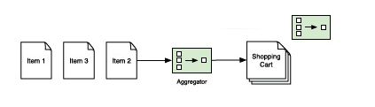

    * Problema	 
        > As mensagens sem estado não chegarão ao endpoint em serviço em uma sequência predeterminada. As mensagens podem ser processadas por diferentes serviços em diferentes velocidades e as mensagens chegarão a um endpoint fora de ordem. Os sistemas SOA garantem a entrega da mensagem, mas não a ordem de entrega. 
    * Solução	 
        > Defina um agregador que receba um fluxo de dados e agrupe mensagens relacionadas como uma única entidade para entrega em um endpoint para processamento adicional. Os agregadores são unidades intermediárias de processamento com estado, mas fornecem payload atômicos de maneira sem estado. 
    * Aplicação	 
        > Agrupe mensagens que fluem através de um barramento de serviço com base no tipo de payload ou em atributos comuns para roteamento e processamento adicionais. 
    * Resultado	 
        > Flexibilidade na implementação porque os provedores de serviços individuais podem processar dados de forma assíncrona sem se preocupar com estado ou sequência, delegando-os a um mecanismo de fluxo de trabalho ou a agregadores em execução na infraestrutura SOA.

 * _Service Bus_
   > Um canal de comunicação para entrega de mensagens de um único endpoint de entrada para um ou mais endpoints de saída e processamento opcional de mensagens "on the fly" à medida que os dados fluem pelo barramento.

    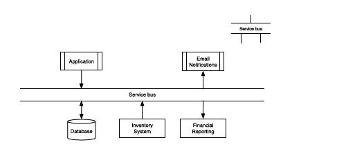 

    * Problema	 
        > Os aplicativos devem se comunicar entre eles, algumas vezes usando diferentes protocolos e tecnologias. As implementações ingênuas dependem de pontos topo de linha ou hub e spoke, conduítes dedicados que aumentam a complexidade, o tempo de implementação e a dificuldade de integração devido ao acoplamento rígido entre os componentes.
    * Solução	 
        >  Forneça um conduíte neutro em relação a dados ou protocolos com pontos abstratos de entrada e saída para interconectar aplicativos independentemente de sua tecnologia subjacente.
    * Aplicação	 
        > Integração heterogênea de sistemas, interoperabilidade herdada e de novos sistemas, abstração de protocolo.
    * Resultado	 
        > Middleware Orientado a Mensagens (MOM): publicar / assinar filas e barramentos de serviço corporativo.  

 * _Dynamic Routing_
     > Um mecanismo eficiente para enviar mensagens para um ou mais destinos com base em regras configuráveis ​​e sem filtragem aplicadas ao payload da mensagem.

    

    * _Problema_	 
        > Os aplicativos devem se comunicar entre eles, algumas vezes usando diferentes protocolos e tecnologias. As implementações ingênuas dependem de pontos topo de linha ou hub e spoke, conduítes dedicados que aumentam a complexidade, o tempo de implementação e a dificuldade de integração devido ao acoplamento rígido entre os componentes.
    * Solução	 
        >  Forneça um conduíte neutro em relação a dados ou protocolos com pontos abstratos de entrada e saída para interconectar aplicativos independentemente de sua tecnologia subjacente.
    * Aplicação	 
        > Integração heterogênea de sistemas, interoperabilidade herdada e de novos sistemas, abstração de protocolo.
    * Resultado	 
        > Middleware Orientado a Mensagens (MOM): publicar / assinar filas e barramentos de serviço corporativo.  

 * _Event-Driven Consumer_
     > Uma configuração que entrega mensagens a um provedor de serviços assim que elas aparecem no canal.

   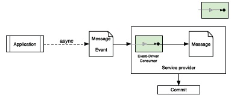 

    * Problema	 
        > Os sistemas de mensagens baseados no bloqueio de ouvintes ou sondagens usam recursos desnecessários ou inativos por nenhuma boa razão, se o canal estiver com fome. O destino da mensagem bloqueia os threads que o serviço poderia usar para outras tarefas.
    * Solução
        > Implementação de um mecanismo de retorno de chamada baseado em barramento ou específico de aplicativo que é chamado apenas se uma mensagem aparecer em seu canal de entrada. O sistema de mensagens pode chamar o retorno de chamada de forma assíncrona ou síncrona.
    * Aplicação	 
        > Sistemas distribuídos com um conjunto variado de consumidores e provedores de serviços com diferentes graus de uso da CPU com base no payload da mensagem; sistemas de processamento de transações atômicas que exigem grande escalabilidade, independentemente do número de consumidores de serviços.
    * Resultado	 
        > O processamento de mensagens é dimensionado de thread único linearmente com o número de mensagens despachadas. Os encadeamentos consomem mensagens à medida que se tornam disponíveis e liberam recursos quando concluídos, para serem reativados quando outra mensagem se torna disponível. Melhor utilização dos recursos em tempo de execução.

 * _Filter_
     > Um canal que extrai dados de uma mensagem ou aplica uma função à medida que flui entre consumidores e serviços por meio de um canal de mensagens.

   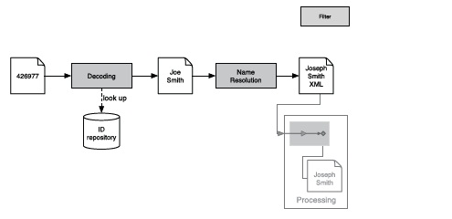 

    * Problema	 
        > Necessidade de implementar processamento flexível de mensagens entre sistemas de maneira independente da plataforma e sem introduzir dependências do sistema ou acoplamentos desnecessários.
    * Solução
        >  Implemente conduítes com uma interface de entrada / processamento / saída simples, modelada após uma função ou canal que facilita a composição de filtros encadeados, permitindo transferências de dados da saída de um filtro para a entrada do próximo. Todos os filtros, independentemente de sua estrutura interna, devem compartilhar a mesma interface externa para facilitar a integração e recombinação.
    * Aplicação	 
        > Uso de funções discretas em mensagens como criptografia, consolidação de dados, eliminação de redundância, validação de dados etc. Os filtros dividem tarefas de processamento maiores em unidades discretas e fáceis de gerenciar, que podem ser recombinadas para uso por vários provedores de serviços.
    * Resultado	 
        > Os filtros eliminam dados e dependências definindo uniformemente um contrato (interface de entrada / saída) que incentiva a reutilização por meio da composição. Os filtros também são componentes intercambiáveis ​​que permitem diferentes funcionalidades de fluxo de trabalho sem alterar o próprio filtro.

 * _Router_
     > Um mecanismo geral para enviar mensagens para um ou mais destinos com base em regras ou filtros configuráveis ​​aplicados ao payload da mensagem.

   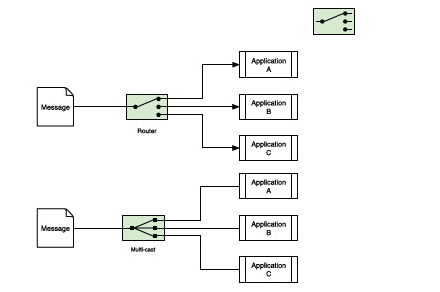 

    * Problema	 
        > Um aplicativo deve conectar-se a um ou mais pontos de extremidade do aplicativo sem se conectar a nenhum deles.
    * Solução
        > Use um canal que permita regras de entrega configuráveis ​​com base no payload da mensagem, filtros de dados ou tipo de conteúdo. O roteamento pode ser seqüencial (os endpoints recebem o payload um após o outro) ou em paralelo (todos os endpoints recebem o payload praticamente ao mesmo tempo).
    * Aplicação	 
        > Entrega de conteúdo em barramentos de serviço, envio de mensagens, proxies de mensagens, aplicativos de integração corporativa e outros sistemas em que as mensagens devem ser entregues aos endpoints após uma sequência de aplicação de um conjunto de regras.
    * Resultado	 
        > A abstração do roteador está em uso em todos os sistemas SOA modernos em algumas formas, disponíveis nos sistemas de enfileiramento ou baseados em barramento, ou implementados em aplicativos personalizados e sistemas de entrega de mensagens, porque fornecem um mecanismo elegante e simples para a independência do sistema entrega de mensagens.

 * _Translator or Transformer_
     > Um mecanismo para converter um payload da mensagem em uma representação para outra à medida que flui pelo sistema de mensagens.

   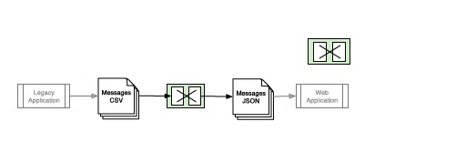 

    * Problema	 
        > A integração heterogênea de sistemas (herdada, interna e fornecida por fornecedores) pode usar diferentes representações de mensagens para entrada ou saída.
    * Solução
        > Forneça um mecanismo independente do sistema para alterar o payload da mensagem e os metadados (envelope) antes da entrega no endpoint do aplicativo.
    * Aplicação	 
        > Conversão de mensagens no ponto de extremidade do aplicativo porque essas traduções dependem do sistema ou do protocolo, diferentemente dos filtros genéricos.
    * Resultado	 
        > Os tradutores são um dos mecanismos de transformação de mensagens mais eficazes, pois permitem que os desenvolvedores e integradores de aplicativos isolem, implementem, testem e mantenham esses componentes do sistema sem modificar o fluxo de trabalho do aplicativo ou a lógica comercial.

### Padrões arquitetônicos

> Os padrões arquiteturais refletem soluções específicas para problemas comuns de design na definição de implementações de sistemas orientados a serviços.

 * _Processamento assíncrono_
     > Um mecanismo para enfileirar mensagens entre um ou mais pontos de extremidade para dissociar tempo e recursos de processamento de cada estágio.

   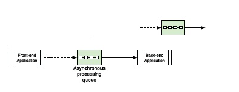 

    * Problema	 
        > O processamento síncrono pode resultar em desempenho ruim do servidor e confiabilidade reduzida.
    * Solução
        > Os consumidores trocam mensagens com os serviços por meio de uma fila de processamento que desacopla o front-end (captura de mensagem) do back-end (processamento); as mensagens chegam na fila a uma taxa diferente da do processamento.
    * Aplicação	 
        > Qualquer aplicativo que exija escalabilidade independente da funcionalidade de front-end e back-end, como consolidação de dados de mainframe (back-end) do atendimento de pedidos de comércio eletrônico (front-end, middleware).
    * Resultado	 
        > As filas de processamento são bem compreendidas e são dimensionadas horizontal ou verticalmente, dependendo dos requisitos do aplicativo. Muitas implementações comerciais e de código aberto, e várias implementações e APIs de referência estão disponíveis.      

 * _Bridge_
     > Um mecanismo para conectar dois ou mais aplicativos por um caminho de dados comum, cada um usando um protocolo diferente e no qual as mensagens podem exigir processamento ou análise conforme fluem entre os endpoints para roteamento.

   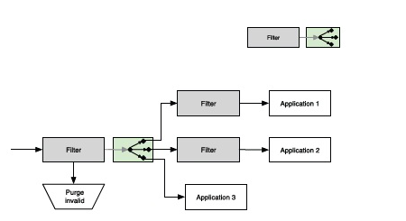 

    * Problema	 
        > Os endpoints do aplicativo podem residir em diferentes partes da rede corporativa, usar protoocls diferentes ou exigir processamento com base em atributos específicos da mensagem.
    * Solução
        > Defina uma ponte entre aplicativos que fornece um mecanismo para rotear mensagens, filtrá-las e transformá-las.
    * Aplicação	 
        > Proxies SOA entre pontos de extremidade de aplicativos na nuvem e pontos de extremidade de aplicativos no middleware ou back-end; Processamento ESB.
    * Resultado	 
        > Bom para estender aplicativos, concentrando o desenvolvimento apenas no processamento intermediário entre o sistema e usando os sistemas existentes como estão. A ponte permite fácil integração dos sistemas legados e SOA. 

 * _Cross-Service Operation_
     > Um mecanismo para coordenar várias atividades de tempo de execução que juntas compreendem um serviço com recursos garantidos de conclusão ou reversão.

   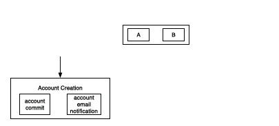 

    * Problema	 
        > Dois ou mais serviços, possivelmente executando em vários sistemas, devem ser concluídos com êxito; se um ou mais falhar, todos os serviços associados a ele e a resposta do aplicativo deverão reverter para seu estado anterior para obter a máxima integridade do aplicativo.
    * Solução
        > Os serviços granulares podem ser agrupados em outro serviço que forneça verificações de integridade e garanta a conclusão com êxito ou degradação normal, se houver, se os serviços granulares falharem.
    * Aplicação	 
        > Sistemas transacionais.
    * Resultado	 
        > Pode exigir que um invólucro do processador de transações (bloqueio comercial ou potencial do fornecedor) colabore com o restante da infraestrutura SOA; consome mais recursos para preservar o estado original de cada serviço granular, caso seja necessário retroceder.

 * _Event-Driven Dispatching_
     > Um mecanismo para rotear mensagens para os consumidores em resposta a eventos específicos na SOA ou acionados por aplicativos específicos em execução na SOA.

   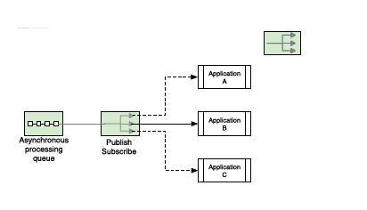 

    * Problema	 
        > Os consumidores devem processar as mensagens assim que estiverem disponíveis em um sistema, mas a pesquisa para essas mensagens é ineficiente.
    * Solução
        > Os consumidores são implementados como reentrantes, bloqueando aplicativos que se inscrevem em um canal de concessões. Os consumidores permanecem inativos até que um evento ou mensagem os desperte; o SOA despacha a mensagem ou evento em resposta aos estados do sistema ou aplicativo.
    * Aplicação	 
        > Publicar / assinar sistemas para suportar aplicativos de processamento assíncrono.
    * Resultado	 
        > É difícil implementar o despacho orientado a eventos nas operações entre serviços. Esse padrão é melhor aplicado a serviços granulares ou para tratar uma operação de serviço cruzado como uma caixa preta ignorando as etapas intermediárias envolvidas na operação.

 * _Process Aggregation_
     > Um método de combinar duas ou mais etapas de processamento interdependentes não sequenciais.

   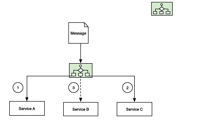 

    * Problema	 
        > Vários serviços podem ser necessários para concluir uma operação, mas nem todos são conhecidos no momento do design, a sequência pode variar dependendo das regras de negócios e não é necessário concluir com êxito todo o processamento granular com êxito (ou seja, não requer capacidade transacional).
    * Solução
        > Um serviço de processamento executa as chamadas de serviço granulares, mantém o estado interno, determina as etapas de processamento e fornece respostas de serviço síncronas ou assíncronas aos consumidores.
    * Aplicação	 
        > Sistemas que requerem vários processos em execução em paralelo, mas não são transacionais ou possuem uma mistura de componentes transacionais e não transacionais.
    * Resultado	 
        > A agregação de processos fornece flexibilidade de integração, mas é difícil de gerenciar. Divida-o em clusters de aplicativos menores (operações entre serviços ou agregações) em linhas funcionais, requisitos de sincronicidade ou qualquer outro critério.

 * _Routing and Filtering_
     > Um mecanismo formal para rotear mensagens para diferentes aplicações e endpoints.

   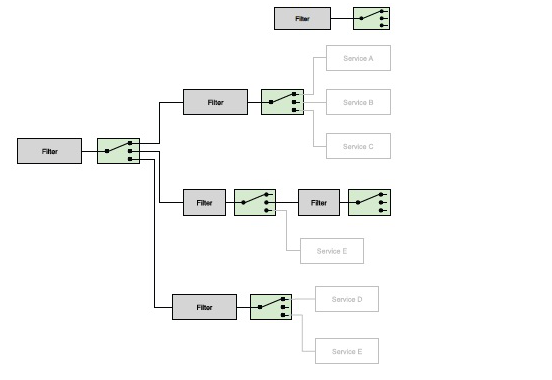 

    * Problema	 
        > As mensagens devem ser enviadas para vários aplicativos com base em seu payload, atributos, protocolo ou todos eles.
    * Solução
        > Forneça um mecanismo formal para rotear mensagens por definição recursiva de filtro, um ou mais roteadores, filtros, roteadores e assim por diante.   
    * Aplicação	 
        > Processamento baseado em regras, fluxo de trabalho, despachantes controlados por eventos
    * Resultado	 
        > A natureza recursiva das definições simplifica o gerenciamento. 
        >   
        > Os implementadores ingênuos algumas vezes definem filtros ou roteadores sem formalizar sua ordem, resultando em acoplamento não intencional de aplicativos ou esgotamento de recursos devido ao uso excessivo de filtros ou roteadores, respectivamente.

 * _Replicator_
     > Mensagens ou payloads devem ser replicadas em vários endpoints com configurações idênticas.

   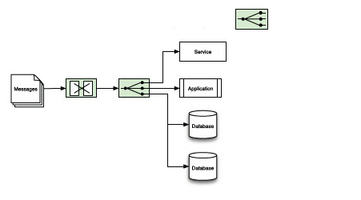 

    * Problema	 
        > Serviços dissociados e escalonáveis ​​horizontalmente ficam presos em um gargalo causado pelo acesso compartilhado a um conjunto de mensagens ou fonte de dados comum.
    * Solução
        > Os recursos de replicação de mensagens ou dados são implementados como parte do fluxo de mensagens SOA, para que aplicativos ou endpoints independentes possam consumi-los em paralelo.  
    * Aplicação	 
        > Recursos de dados somente leitura ou mensagens que fluem através da SOA para aumentar a taxa de transferência.
    * Resultado	 
        > Custo adicional, gerenciamento de complexidade, se os replicadores puderem proliferar desmarcados. Excelente maneira de fornecer escalabilidade quando os replicadores estão confinados a caminhos de serviço de domínio de problemas específicos.