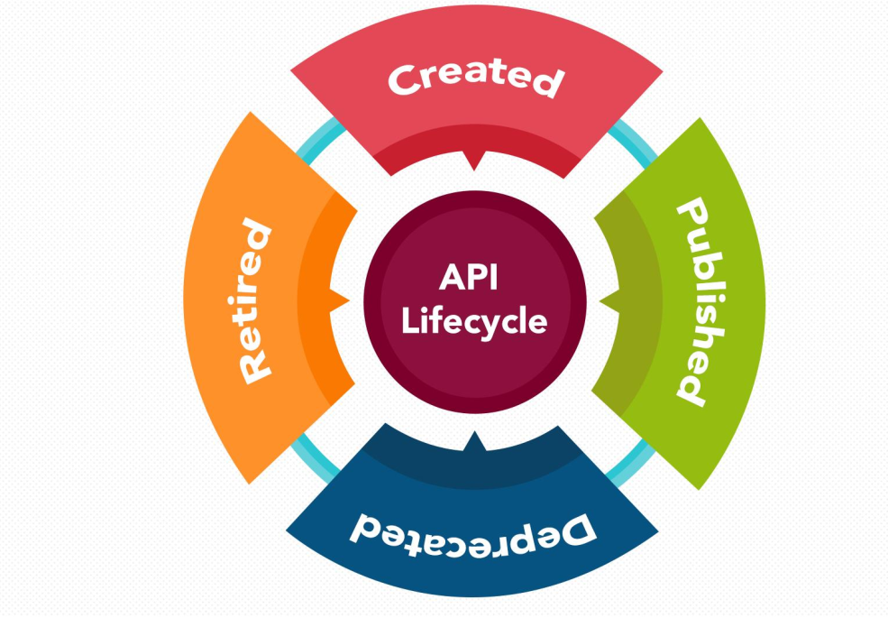

## Características;
   > Na prática, APIs são uma espécie de “cola digital” entre duas pontas, ou seja, ela consegue trazer a informação de um sistema de uma maneira eficiente e padronizada, permitindo uma integração e consumo desse dados mais facilitado por parte do desenvolvedor. 
   > Suas aplicações variam desde exposição de serviços para desenvolvedores independentes, ou também para comunicação com outros sistemas parceiros que exijam agilidade e rapidez na integração.
   

### Características 
    
 * API é um conjunto de rotinas e padrões de programação para acesso a um aplicativo de software ou plataforma baseado na Web.
 * A sigla API refere-se ao termo em inglês "Application Programming Interface" que significa em tradução para o português "Interface de Programação de Aplicativos".
 * Na prática, APIs são uma espécie de “cola digital” entre duas pontas, ou seja, ela consegue trazer a informação de um sistema de uma maneira eficiente e padronizada,  ermitindo uma integração e consumo desse dados mais facilitado por parte do desenvolvedor. 
 * Suas aplicações variam desde exposição de serviços para desenvolvedores independentes, ou também para comunicação com outros sistemas parceiros que exijam agilidade e rapidez na integração.
> As APIs são mais do que apenas interfaces para o backend, são habilitadoras fundamentais dos negócios digitais.

 * Distribuir dados/serviços por Novos Canais, através de diferentes interfaces e dispositivos (IoT), ou oferecer uma experiência omnichannel aos usuários;
 * Compor dados/serviços em Novos Produtos, ampliar ofertas existentes ou comercializar APIs-as-Products com diferentes formas de monetização, além de reduzir o time-to-market;
 * Desenvolver uma Nova Arquitetura de TI, event-driven e baseada em microserviços e mesh apps, para alcançar maior agilidade e escalabilidade, reuso, desacoplamento, deploys pequenos, flexibilidade, responsividade;
 * Explorar Novos Modelos de Negócio combinando recursos e estratégias, como a Plataformização;
 * Consumir Novas Tecnologias como serviços (AI, por exemplo);
 * Criar iniciativas de Inovação Aberta, permitindo que desenvolvedores terceiros criem aplicativos e serviços próprios a partir de open APIs, realizando hackathons e executando projetos de co-criação com parceiros ou startups.
> Geralmente API’ são gerenciadas por API’s Gateways, basicamente o Gateway é uma interface que recebe as chamadas para seus sistemas internos, sendo uma grande porta de entrada.      

> Ele pode atuar de cinco diferentes maneiras:
 * *Filtro*: para o tráfego de chamadas dos diferentes meios (web, mobile, cloud, entre outros);
 * *Única porta de entrada*: para as diversas APIs que você deseja expor;
 * *Componente* essencial: gerenciamento de APIs.
 * *Roteador*: tráfego nas APIs e de Rate Limit;
 * *Mecanismo de segurança*: com autenticação, log e muito mais.

## Ciclo de Vida de uma API.

 

### Ciclo de Vida

 * Construção: depois de ter uma estratégia e um plano sólidos, é hora de criar sua API.
 * Teste: antes da publicação, é importante concluir o teste da API para garantir que eles atendam às expectativas de desempenho, funcionalidade e segurança.
 * Publicação: depois de testado, é hora de publicar suas APIs para ficarem disponíveis para os desenvolvedores.
 * Proteção: riscos e preocupações com segurança são um problema comum atualmente, validar contra OWASP top ten é importante antes de lançar suas APIs.
 * Gerenciamento: depois de publicados, seus desenvolvedores precisam gerenciar e manter APIs para garantir que estejam atualizados e a integridade de suas APIs não seja comprometida.
 * Integração: quando você oferece suas APIs para consumo público ou privado, a integração é um componente importante para que os desenvolvedores entendam os principais recursos.
 * Analisando: suas APIs estão ativas, mas como estão? Ferramentas de API Analytics ajuda você a entender seus negócios digitais e detectar anormalidades antes que elas afetem seus negócios.
 * Promoção: existem várias maneiras de comercializar uma API, incluindo listá-la em um API Marketplace.
 * Monetização: você pode oferecer suas APIs gratuitamente ou, quando houver uma oportunidade, monetizar suas APIs e gerar receita adicional para seus negócios.
 * Aposentadoria: A aposentadoria de APIs é o último estágio de um ciclo de vida da API e ocorre por vários motivos, incluindo alterações de tecnologia e preocupações de segurança.