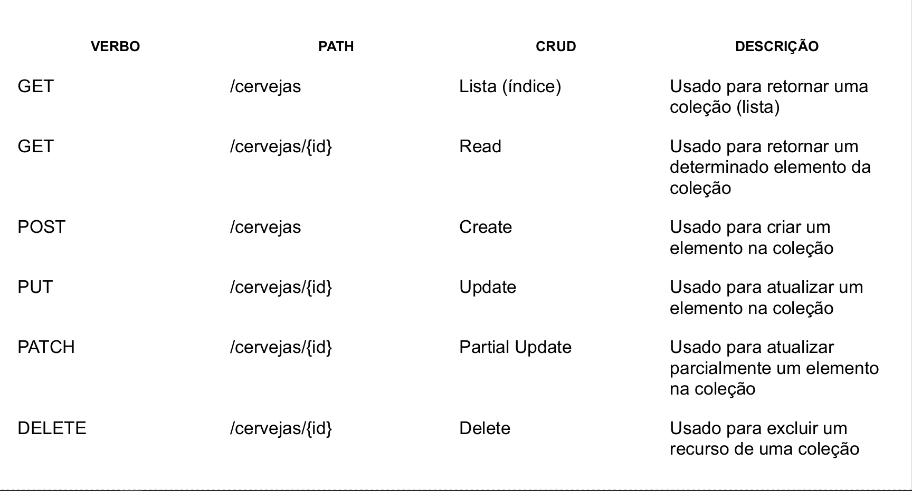
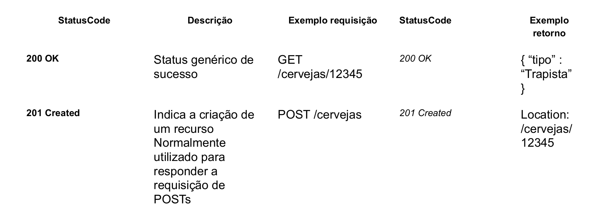
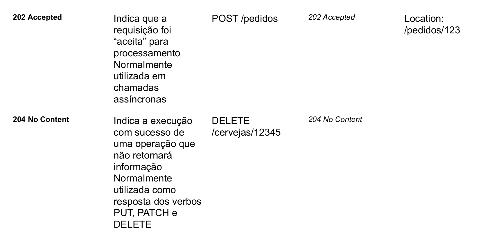
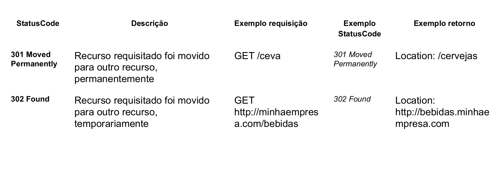
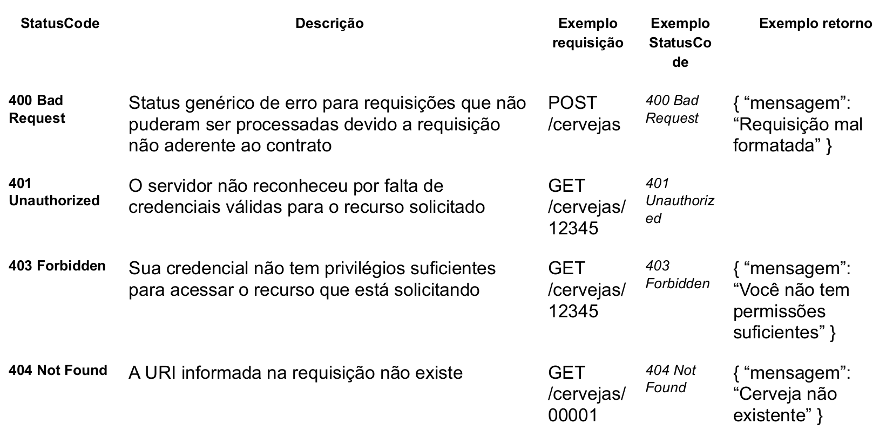
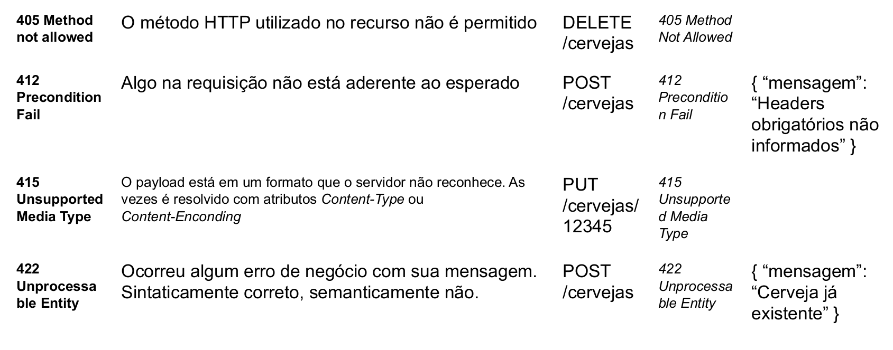
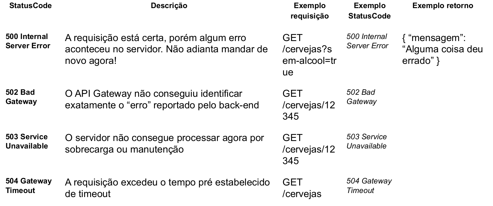

# Boas práticas e modelagem avançada de APIs.

## Definição  
  > APIs são fiéis ao estilo arquitetural REST baseadas nos protocolos HTTP definido pelos seguintes aspectos:
  > Uma URL, tal como http://minhaempresa.com.br/negocio/dominio/v1/cervejas
  > Um Media Type que define os elementos de dados de transição de estado (JSON, XML, Atom). 
  > Métodos HTTP (ex: GET, POST, PUT, DELETE, PATCH).

## Recursos
  > É uma abstração de uma informação (normalmente entidades de negócio) gerenciada por uma aplicação.O recurso representa uma coleção onde cada elemento possui um identificador único.
  > Devem ser um substantivo no plural, não um verbo:
  * POST /cervejas
  * POST /carros
  * GET /produtos/{id}   

## Versionamento
   * Implemente o controle de versão na URI antes dos recursos e exponha as versões via path.

   * Versão 1 (v1) https://minhaempresa.com.br/bebidas/v1/cervejas
   * Versão 2 (v2) https://minhaempresa.com.br/bebidas/v2/cervejas

   * A versão deve ser atualizada quando quebrar o contrato com o cliente. Utilizar a estratégia do Semantic Versioning para o versionamento major, minor e patch da API.

## Operações
   > Uma operação é uma unidade de uma API que você pode chamar. 
   >
   >É composta de um verbo HTTP e um caminho de URL que é subordinado ao contexto principal da API (URI).
   > Criando uma operação você define como a API será exposta para utilização.
   >
   > Temos as seguintes operações: operacoes

 

## Status Code - Successful - 2xx

 

## Status Code - Successful - 2xx

 

## Status Code - Redirect - 3xx

 

## Status Code - Client Error - 4xx

 

## Status Code - Client Error - 4xx

 

## Status Code - Server Error

## Filtros, Paginação e Ordenação
   > Os mecanismos de filtro , paginação e ordenação são utilizados em pesquisas (métodos GET) com o intuito de otimizar resultados com base em um conjunto de dados.
   
   * GET /cervejas?_offset=5&_limit=3
   * GET /cervejas?tipo=IPA
   * GET /cervejas?_sort=“preco|asc”
   * GET /cerveja?preco=greaterThan(10)
  
  
