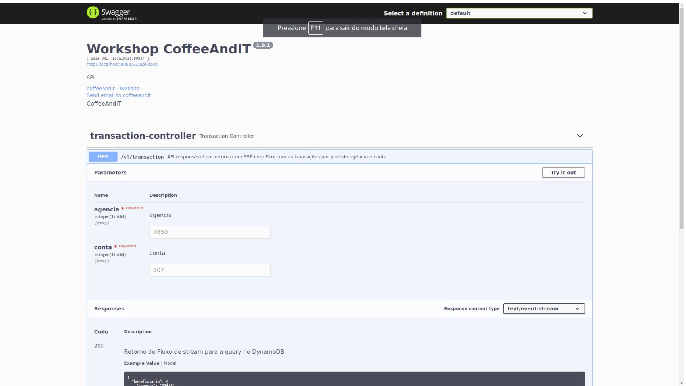
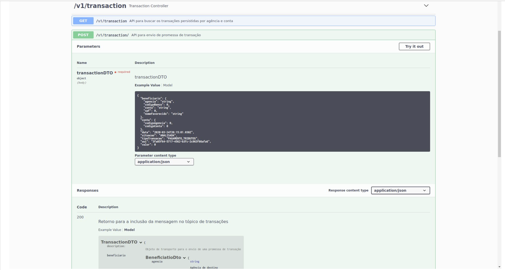
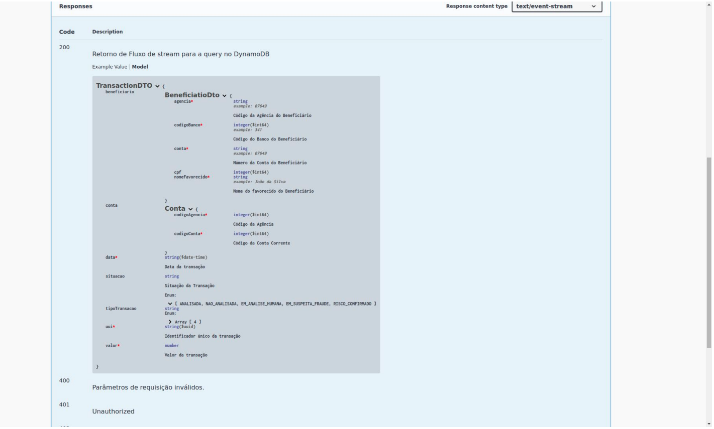
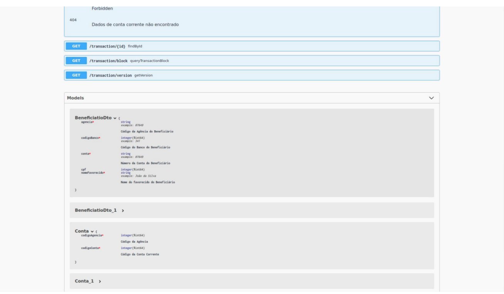
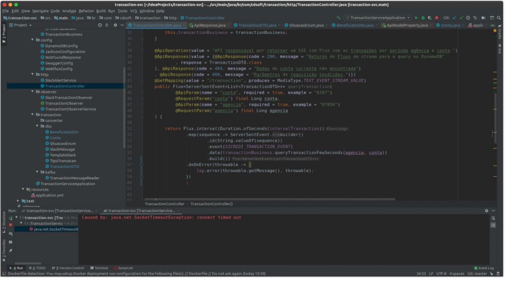
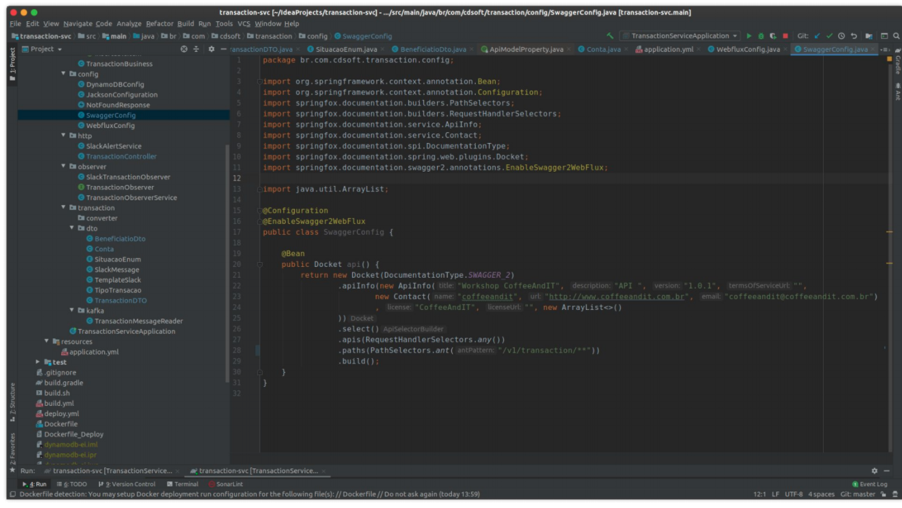
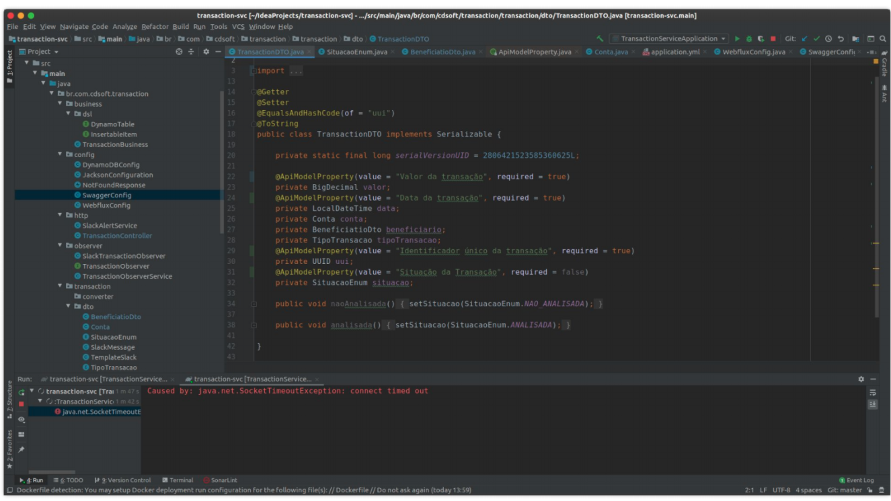

# Swagger e OpenAPI
> O Swagger é um projeto composto por algumas ferramentas que auxiliam o desenvolvedor de APIs REST em algumas tarefas como:
>
>Modelagem da API.
>
>Geração de documentação (legível) da API.
>
>Geração de códigos do Cliente e do Servidor, com suporte a várias linguagens de programação.

>  A Especificação OpenAPI foi doada à Linux Foundation sob a Iniciativa OpenAPI em 2015.
> A especificação cria uma interface RESTful para desenvolver e consumir facilmente uma API, mapeando efetivamente todos os recursos e operações associados a ela.
> O Swagger é um projeto composto por algumas ferramentas que auxiliam o desenvolvedor de APIs REST em algumas tarefas como:
   * Modelagem da API.
   * Geração de documentação (legível) da API.
   * Geração de códigos do Cliente e do Servidor, com suporte a várias linguagens de programação.
> Para isso, o Swagger especifica a OpenAPI, uma linguagem para descrição de contratos de APIs REST. A OpenAPI define um formato JSON com campos padronizados (através de um JSON Schema) para que você descreva recursos, modelo de dados, URIs, Content-Types, métodos HTTP aceitos e códigos de resposta.   

 
 
 
 
 
 
 

## DEMO

   * Spring Configuration Swagger
   * Annotations Swagger
   * Swagger-ui