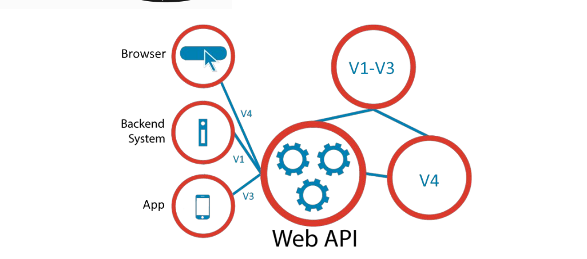

# Versionamento de APIs
> Um motivo comum para o controle de versão de APIs Web se deve aos contratos usados para evitar a quebra de aplicações clientes.
>
>É necessário permitir que clientes e servidores sejam alterados de forma independente, e também ser capaz de comunicar as alterações da API para os desenvolvedores de clientes. Swagger é um projeto composto por algumas ferramentas que auxiliam o desenvolvedor de APIs REST em algumas tarefas como:

 

## Versionamento de API’s

   * Um motivo comum para o controle de versão de APIs Web se deve aos  contratos usados para evitar a quebra de aplicações clientes.
   * É necessário permitir que clientes e servidores sejam alterados de forma independente, e também ser capaz de comunicar as alterações da API para os desenvolvedores de clientes.

### De forma mais convencional temos 2 formas de versionar as API’s. 
   * Versionamento na URL.
   * Versionamento no Header.

> Quando versionamos pela URL temos três maneiras de fazer isso: subdomínio, path ou query string.
> 
> No modelo de subdomínio você especifica a versão logo no início da URL, por exemplo:
#### HTTP GET
   * _https://api-v1.coffeeandit.com.br/cursos_
>Notem que logo após o api, eu coloquei o “-v1”, que especifica a versão, e nesse caso quem for consumir pode alterar apenas o subdomínio na requisição.   

> No modelo de path você especifica a versão após a base url, por exemplo:
#### HTTP GET 
   * _https://api.coffeeandit.com.br/v1/cursos_
>Essa é uma das abordagens mais utilizadas, pois além de dar um visual mais clean na URL, facilita a navegação para outras versões da API, ou seja, é mais dev-friendly comparado a outras abordagens.

### Via query string, por exemplo:
#### HTTP GET
   * _https://api.coffeeandit.com.br/cursos?version=1.0_
> Notem que na URL o parâmetro via query string “version” e foi especificado a versão 1.0 da API.
> Essa é uma abordagem que já foi muito utilizada, mas que caiu em desuso, pois além de prejudicar a navegação para outras versões, a legibilidade da URL fica ruim em cenários de muitos parâmetros na query string.

> O versionamento via header pode ser via HTTP content-type, ou seja, utilizando o header “Accept” na requisição, como por exemplo:
#### HTTP GET
   * _https://api.coffeeandit.com.br/cursos_
   * _Accept: application/vnd.cursos.v2+json_
> Se formos seguir a especificação ao pé da letra, essa é a maneira correta de fazer o versionamento de APIs.