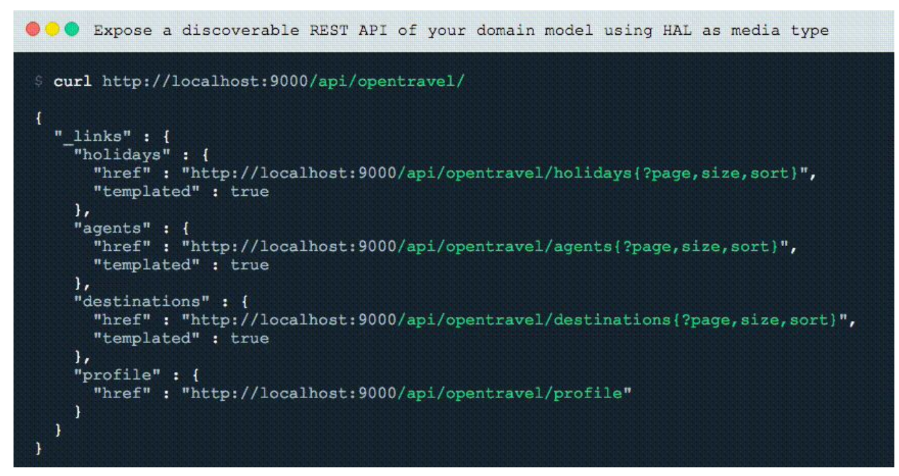

# HATEOAS e Discoverability

## HATEOAS _Netflix pioneira_
> O estilo de arquitetura REST permite usar links de hipermídia no conteúdo da resposta para que o cliente possa navegar dinamicamente para o recurso apropriado percorrendo os links de hipermídia. 
>
> HATEOAS (Hypermedia as the Engine of Application State) - é uma restrição da arquitetura de aplicativos REST que mantém a arquitetura de estilo RESTful exclusiva da maioria das outras arquiteturas de aplicativos de rede. O termo "hipermídia" refere-se a qualquer conteúdo que contenha links para outras formas de mídia, como imagens, filmes e texto.
>
> O estilo de arquitetura REST permite usar links de hipermídia no conteúdo da resposta para que o cliente possa navegar dinamicamente para o recurso apropriado percorrendo os links de hipermídia.
>
> Acima, conceitualmente, é o mesmo que um usuário da Web navegando pelas páginas da Web, clicando nos hiperlinks relevantes para alcançar um objetivo final.
>
>
>Por exemplo, a resposta JSON fornecida abaixo pode ser de uma API como HTTP GET
> _http://api.domain.com/management/departments/10_

>     {
>
>        "departmentId": 10,
>
>        "departmentName": "Administration",
>
>        "locationId": 1700,
>
>        "managerId": 200,
>
>        "links": [{
>
>           "href": "10/employees",
>
>           "rel": "employees",
>
>           "type" : "GET"
>
>                 }]
>     }

## Discoverability

> A capacidade de descoberta da API está relacionada ao HATEOAS, esse conceito de API REST é sobre a capacidade de descoberta total em um Recurso da Hipermídia.
>
> Com esse recurso, a API REST que fornece URIs completos nas respostas ao cliente significa que nenhum cliente precisará "compor" um URI. A API do cliente se torna independente da estrutura do URI. Com 2 pontos acima, a API é mais flexível e permite que o desenvolvedor altere o esquema do URI sem interromper a API. (Lembre-se, a API fornece todos os URIs, eles não são criados dinamicamente pela API do cliente). 
>
> O objetivo final de qualquer API RESTful é auto-explicativo, de modo que a API do cliente não precise ter conhecimento prévio de um contrato formal para consumir seu conteúdo / funcionalidade.

 