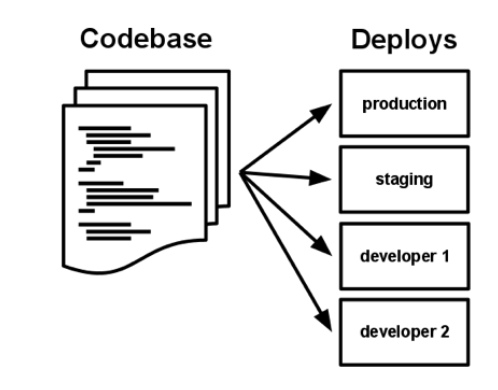
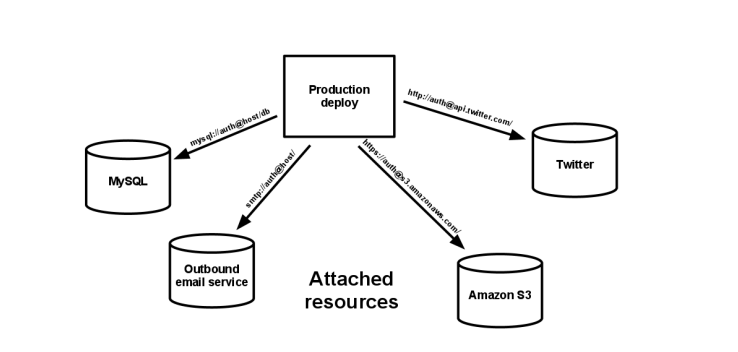
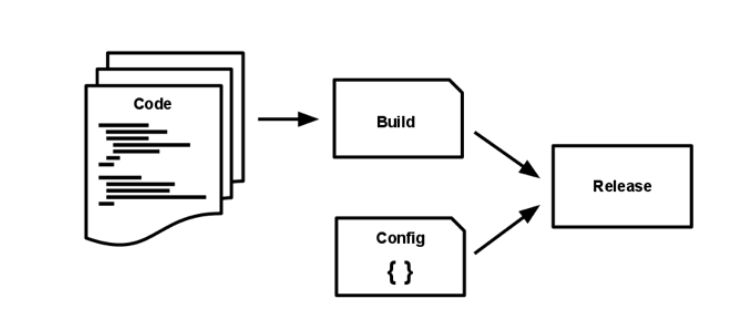
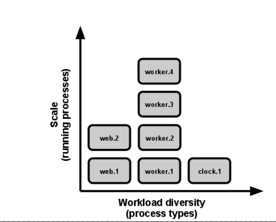

# 12 Fatores;
   > Twelve-Factor App é uma metodologia usada para a construção de aplicações na nuvem. A metodologia fornece doze práticas definidas para permitir que aplicações possam ser construídas visando portabilidade e resiliência quando implantadas na web.
   

## 1-Base de Código

 * Somente uma base de código por aplicação.;
 * Vários deploys por aplicação.
 * Desenvolvedor possui uma cópia local do repositório.

 

## 2-Dependencias

 * Declare e isole explicitamente as dependências;
 * Uma aplicação 12 fatores nunca confia na existência implícita de pacotes em todo o sistema;
* Uma declaração de dependência explícita é que simplifica a configuração da aplicação para novos desenvolvedores;
* Na prática:
   * Tenha sempre um gerenciador de dependências configurado para seu projeto (maven, gradle, npm, pip e etc);

## 3-Configurações   

* A configuração de uma aplicação é tudo que é provável variar entre deploys(homologação, produção, desenvolvimento, etc).
* Uma aplicação 12 fatores armazena configuração em variáveis de ambiente ou algum recurso de configuração distribuída.
* Necessitamos de facilidade na troca de ambientes sem ter a necessidade de alterar o codebase.

## 4-Serviços de Apoio

* Trate serviços de apoio como recursos anexados;
* Serviço de apoio é qualquer serviço que o App consuma via rede como parte de sua operação normal:
   * Ex: Banco de Dados, Mensageria, Cache.
* Não se deve fazer distinção entre serviços locais e terceiros;

 

## 5-Construa, lance, execute

* Uma base de código é transformada em um deploy através de 3 estágios:
   * Construção: Converte o repositório em um pacote executável;
   * Lançamento: Combina o artefato construído com a configuração do deploy.
   * Execução: Roda o app no ambiente de execução através dos processos específicos do APP.
* O app 12 fatores utiliza separação estrita entre os estágios de construção, lançamento e execução.

 

## 6-Processos

* Você não deve introduzir estado em seus serviços; os aplicativos devem ser executados como um processo único e sem estado.
* Os processos dos Doze Fatores são stateless e não compartilham nada. Esse fator está no núcleo da arquitetura de microsserviços.

## 7-Vínculo de porta

* Seu serviço deve estar visível para outras pessoas via ligação de alguma porta. Se você criou um serviço, verifique se outros serviços podem tratar isso como um recurso, se assim o desejarem. O aplicativo de doze fatores é completamente independente de outros recursos.

## 8-Concorrência

* Divida seu aplicativo em pequenos pedaços, em vez de tentar aumentar seu aplicativo (executando uma única instância na máquina mais poderosa disponível). Aplicativos pequenos e definidos permitem a expansão conforme necessário para lidar com as cargas variadas. O processo deve ser dimensionado individualmente, com o Fator 6 (sem estado), torna-se transparente este tipo de abordagem.

 

## 9-Descartabilidade

* Os processos devem consumir menos tempo. Certifique-se de poder correr e parar rapidamente. E que você pode lidar com falhas. Sem isso, o dimensionamento automático e a facilidade de implantação e desenvolvimento estão sendo diminuídos. Você pode conseguir isso com contêineres.

## 10-Paridade entre desenvolvimento e produção

* Mantenha o desenvolvimento, a homologação e a produção o mais semelhante possível, para que qualquer pessoa possa utilizá-lo da mesma forma. A implantação contínua precisa de integração contínua com base em ambientes correspondentes para limitar desvios e erros. Isso também incentiva implicitamente uma cultura DevOps na qual o Desenvolvimento e as Operações de Software são unificados. *A conteinerização é uma grande ajuda aqui*.

## 11-Logs

* Trate os logs como fluxos de eventos. O registro é importante para validar erros e também verificar a integridade geral do seu sistema. Ao mesmo tempo, seu aplicativo não deve se preocupar com o armazenamento dessas informações. Esses logs devem ser tratados como um fluxo contínuo capturado e armazenado por um serviço separado.

## 12-Processos Administrativos

* Execute tarefas administrativas / gerenciamento como processos pontuais - tarefas como migração de banco de dados ou execução de scripts pontuais no ambiente. Para evitar mexer com o banco de dados, use as ferramentas criadas ao lado do aplicativo e isole completamente sua aplicação por exemplo.

## Para refletir

* Alguns pontos nos 12 fatores podem parecer triviais, mas ao executar mais de 20 serviços em poucos ambientes, eles podem ser de grande importância.