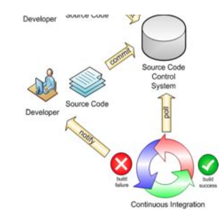
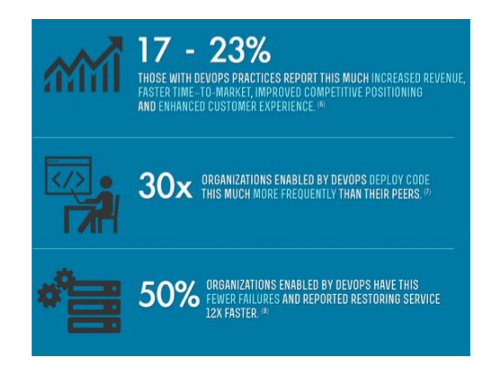

# CI/CD
   > A integração contínua (CI) é uma prática de desenvolvimento de software de DevOps em que os desenvolvedores, com frequência, juntam suas alterações de código em um repositório central. Deploy Contínuo (CD) é o ato implantar o produto produzido no servidor de aplicação, ou seja, entregar o produto ao cliente, seja ele em ambiente de desenvolvimento, stagging ou produção.

## Continuous Integration

 > _[...] integrating code is one of a common class of problems in software, where time moves linearly but pain moves exponentially: the longer you delay, the worse > the problem becomes”_ 
 >
 > _Neal Ford - Director at ThoughtWork_

 
 
* Uma prática de desenvolvimento de software onde os membros do time de desenvolvimento integram seu trabalha constantemente;
* Cada integração é feita automaticamente por um processo para detectar falhas rapidamente;
* Reduz drasticamente problemas de integração e possibilita o desenvolvimento de um software seguro e coeso;
* Escreva testes automatizados para desenvolvedores;
* Execute compilações privadas;
* Confirme código com frequência;
* Não confirme código com defeito;
* Evite obter código com defeito;
* Corrija construções com defeito imediatamente;
* Todos os testes e inspeções devem passar;

## Continuous Delivery

>Quão frequentes você entrega software em produção para os seus usuários?
* Mais de uma vez por dia?
* Mais de uma vez por semana?
* Mais de uma vez por mês?
* Mais de uma vez por ano?
* Uma vez por ano ou menos?
* Releases entregue em produção de forma frequente:
  * Medida real de progresso
  * Feedback do usuário
  * Reduz consideravelmente o risco de release

 

* Princípios
   * Cada commit gera um release candidate
   * Automatize tudo que pode ser automatizado
   * If it hurts, do it more often and bring the pain forward "_Se doer, faça-o com mais frequência e traga a dor para frente_"
   * A qualidade interna é obrigatória
   * Testes automatizados são essenciais
   * Todo mundo é responsável pela release
   * Pronto significa released _DOD e DOR - Definitions of Ready/Definitions of Done_
   * Melhoria Contínua(Continuous Improvement)

> _“Continuous Delivery deixou de ser um diferencial tecnológico para ser uma necessidade dentro das organizações”_
>
> _Jezz Humble - 2011_

 

## Ferramentas

## Build Pipeline

* Commit Stage:
   * Poll SCM;
   * Compilação;
   * Cobertura dos testes;
   * Unitários e integração;
   * Qualidade do código fonte;
   * Conformidades com padrões empresariais;
   * Possíveis bugs;
   * Boas práticas;
   * Empacotamento e publicação;
* Acceptance Stage:
   * Testes automatizados;
   * Testes funcionais;
   * Testes de aceitação;
   * Testes de performance;
   * Testes de segurança;   
* Production Stage:
   * Etapa final do pipeline;
   * Requer permissão para executar;
   * Going live;
   * Deve ser apenas mais um deployment;
   * Tenha em mente as alternativas de “remediação”;
   * Conheça as alterações do seu software;

## Considerações

* Automatização + testes = sucesso;
* Reduza os riscos com releases incrementais;
* Existem inúmeras formas de se construir um build pipeline. Descubra a sua;
* Cultura de DevOps é necessária;
* Prepare-se: quanto tempo você demora para reconstruir o seu ambiente a partir do zero?
* Dificuldades:
   * Exige mudança cultural;
   * Maior dificuldade encontrada nas implantações de Continuous Delivery;
   * Exige Ciclos Curtos;
   * Empresas organizadas em silos/áreas;
   * Requer envolvimento de todos;

