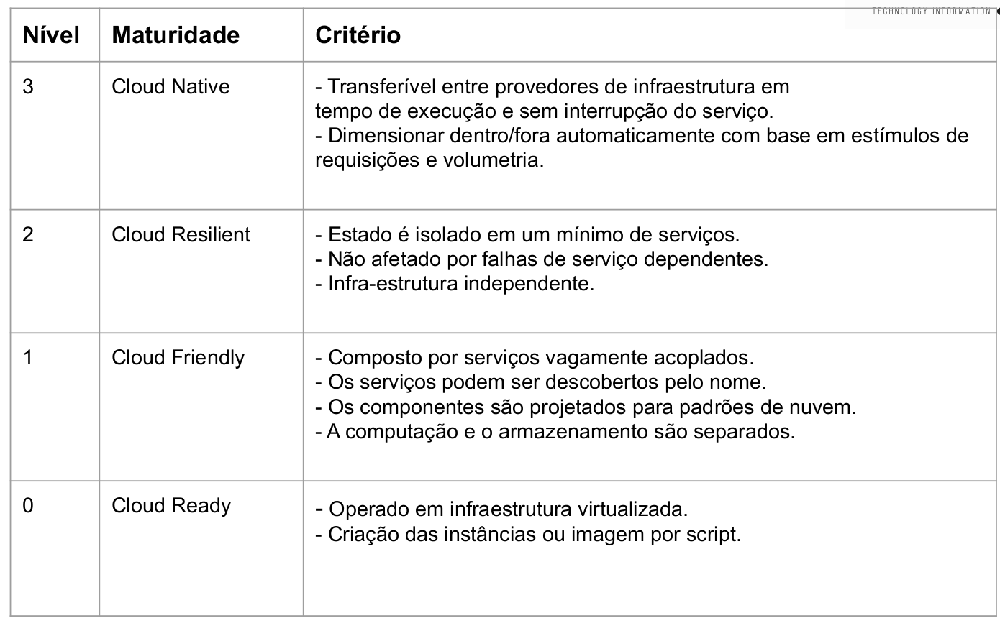
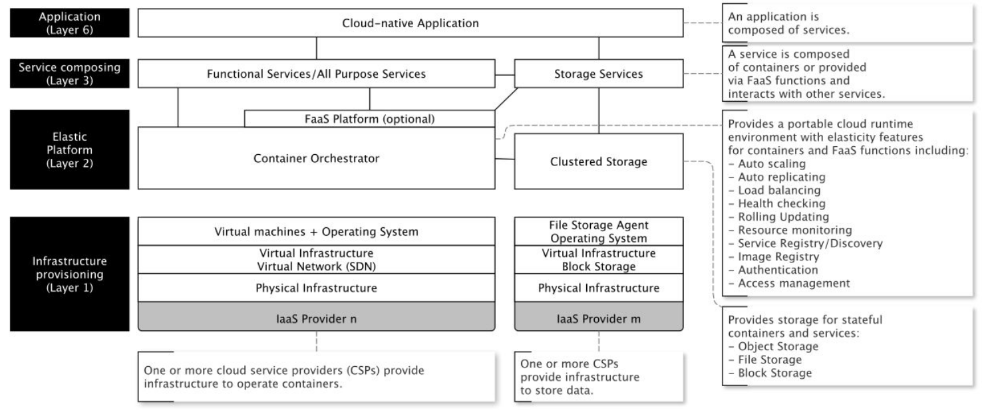

## Maturidade em Cloud Native;
> O Cloud Native é muito novo e a maioria das empresas não têm experiência para navegar por conta própria. É muito fácil e caro cometer erros.
>
> A Matriz de maturidade de soluções de cloud avalia a disponibilidade da nuvem em nove áreas cruciais de transformação, tanto técnicas quanto centradas no ser humano.
>
> Os resultados definem e descrevem onde você está agora - e mostram para onde ir a partir daqui.
   

> As empresas podem gerar enorme crescimento econômico e valor comercial, fornecendo serviços ou aplicativos baseados na nuvem: Instagram, Uber, WhatsApp, NetFlix, Twitter - e ainda pequenas empresas surpreendentementes (se relacionarmos o número modesto de funcionários dessas empresas em seu crescimento econômico notável) cujos serviços são usados e distribuídos com freqüência com cloud computing. 
> 
> No entanto, mesmo um modelo de negócios de crescimento rápido deve ter conseqüências e dependências a longo prazo, por isso maturidade em cloud é fator principal para escalar negócios, arquiteturas e usuários.
> 
> Por isso segundo _[OPEN DATA CENTER ALLIANCE][odca]._  possuímos alguns passos para fazer nossa passagem e maturidade num modelo de maturidade de nuvem.

 

### Cloud Native Stack - Exemplo 

  

### Maturidade em Cloud Native

> Muitas vezes, a computação em nuvem é investigada do ponto de vista do modelo de serviço (IaaS, PaaS, SaaS), ou no ponto de vista de implantação (nuvem privada, pública, híbrida ou comunitária).
> Do ponto de vista de arquitetura e engenharia de software, parece mais útil ter visualizações sobre os níveis de tecnologia envolvidas e aplicadas em ambientes nativos de nuvem por camada, por isso as dividimos em 6 camadas.
> 
> 1) _Provisionamento de infraestrutura_: Este é um ponto de vista familiar para os engenheiros que trabalham no nível de infraestrutura e como o IaaS é entendido, O IaaS lida com o deploy de nós de computação isolados para uma cloud específica tendo como principal objetivo tornar mais fácil e acessível o fornecimento de recursos, tais como servidores, rede, armazenamento e outros recursos de computação essenciais para construir um ambiente sob demanda, que podem incorporar sistemas operacionais e aplicações.
>
> 2) _Plataformas elásticas em cluster:_ Este é um ponto de vista familiar para os engenheiros que lidam com com escalabilidade horizontal entre nós. Clusters são um conceito para lidar com muitos nós da Camada 1 como um nó de cálculo lógico (um cluster). Esse tipo de tecnologia é frequentemente a espinha dorsal para ambientes portáteis de cloud runtime, porque eles estão escondendo centenas ou milhares de nós únicos adequadamente. Além disso, essa camada realiza a base para definir serviços e aplicações sem referência a serviços de nuvens específicas, sendo assim, fornece uma base para evitar o aprisionamento de cloud provider. 
> 
> 3) _Orquestradores de serviço_: Este é um ponto de vista familiar para os engenheiros de aplicação que lidam com Web services em arquiteturas orientadas a serviços (SOA). 
>
> Esses microservices operam em uma plataforma de Orquestração de Serviços (como Kubernetes, Mesos, Swarm, Nomad etc) dessa forma fazendo a orquestração complexa e dimensionamento desses serviços. Via de regra esses orquestradores ficam hospedados em um cluster conforme descrito na camada 2.
> 
> 4) _Aplicação_: Este é um ponto de vista familiar para desenvolvedores e usuários finais de cloud services ou cloud-native applications.
>
> Esses serviços em nuvem são compostos por nossos micro serviços e de serviços menores da Camada 3 e que estão sendo operados em clusters formados por nós de computação e storages da camada 2.
>
> 5) _Arquiteturas de aplicações em nuvem a partir de uma utilização de recursos_: Esse tema é grande e vamos tratá-lo ao longo do curso, porém de forma macro possuímos os itens que devem ser observados como:
>     * Isolamento de estado - Os componentes sem estado são mais fáceis de escalar / diminuir horizontalmente do que os componentes com estado.
>        * Obviamente, componentes com estado não podem ser evitados, mas componentes com estado devem ser reduzido ao mínimo e realizado por sistemas de armazenamento escalonáveis horizontais intencionais (frequentemente eventuais bancos de dados NoSQL consistentes) ou servidores de cache para a replicação do estados entre todas as aplicações que são compartilhadas.
>        * Um exemplo de aplicações que guardam estados são aplicações que guardam as informaçẽos de login de usuário na aplicação.
>     * _Versionamento de API’s_ - Conforme já vimos no módulo de API’s é muito importante termos a evolução de produtos com versões isoladas e com a garantia de não quebrar contratos com versões anteriores.
>     * _DevOps_ - Como veremos durante o curso a importância de criarmos pipelines contínuos validando a aplicação, testes de unidades, a análise semântica de código, cobertura de testes unitários, testes de contratos de API’s, testes de integração entre componentes, testes de segurança e testes de stress e performance.
>     * _Aplicação não acopladas_ - Como veremos em Arquiteturas SEDA a importância de não manter fluxos síncronos, para poder criar aplicações escaláveis não acopladas e com suporte a grande volumetría usando mensajerías como RabbitMQ, Apache Kafka, Kinesis e outros brokers de mensagens.
>
> 6) _Camada de Integração e Serviços_ - Nesse camada temos as nossas aplicações que são desenvolvidas por nós, aplicações de outros times e terceiros que se integram com a nossa, eventos que são gerados por nossa aplicação e eventos que reagimos de nossa aplicação.

[odca]:https://www.oaca-project.org/wp-content/uploads/2018/07/Cloud-Adoption-Framework-v1.0.pdf