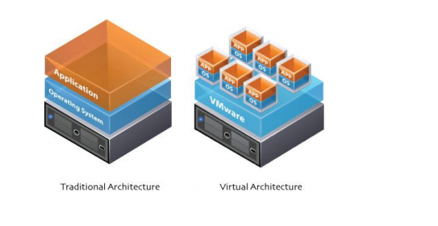

## Cloud Ready;

> Os aplicativos cloud-ready não requerem re-arquitetura ou refatoração.
>
> Eles oferecem migração com menos esforço para a nuvem com uma menor taxa de disponibilidade.
>
> Como esses workloads não foram projetadas para um cluster ou para alta disponibilidade, essas aplicações sofrem por rodarem com um único ponto de falha.
>
> Os aplicativos cloud-ready são caros de manter pois usam em geral técnicas de virtualização.
>
> Isso se deve principalmente à maneira como eles consomem os recursos de computação, armazenamento e rede, mesmo quando ociosos.
> 
> Cada componente de um aplicativo é executado em uma VM dedicada, sem margem para otimização.
> 
> Atualizar ou aplicar patches resulta em tempo de inatividade, tornando a manutenção complexa e cara.

## Cloud Ready - Virtualization;

> A virtualização de servidores é a técnica de execução de servidores virtuais para um servidor físico que permite o compartilhamento e execução de dados com recursos que proporcionam critérios e benefícios com maior disponibilidade de aplicações e serviços, o qual pode aperfeiçoar a estrutura do ambiente.
> 
> Com diversos servidores as vantagens são inúmeras, destacando-se redução de espaço físico para armazenamento, redução de energia e a redução de custos.
>
> Diante disso, tem-se como tema a Virtualização de Servidores, que podemos usar como exemplo o serviço EC2 da AWS.

### Formas de Virtualização

> Existem várias formas de uso de virtualização, nas quais se destacam: a virtualização assistida por hardware, a virtualização de aplicativos, a virtualização de storage e a virtualização do sistema operacional.

>  

### Formas de Virtualização

* _Virtualização assistida por hardware_: reproduz de maneira similar os componentes físicos da máquina, emulando processador, memória cache, ciclos de clock e os demais componentes e processos. Compreende o tipo mais complexo de virtualização, no qual permite que o sistema guests rode isolado no hardware do sistema host. Neste processo, existem circuitos no processador e no controlador de memória que possibilitam ao hardware rodar simultaneamente vários sistemas operacionais.

* _Virtualização de aplicativos_: possibilita a execução de qualquer aplicação, protegendo o sistema operacional de ações que poderiam comprometer a sua performance. Neste processo, as aplicações não usam arquivos, bibliotecas do sistema e chaves de registro, elas apenas são executadas. Acontece o isolamento da aplicação no interior da máquina virtual, tornando-se independente do sistema operacional, uma vez que pode ser executada em qualquer sistema que possua a máquina virtual instalada. Por exemplo, a Java Virtual Machine (JVM), que pode rodar aplicativos Java em qualquer sistema operacional que possua a máquina Java instalada.

* _Virtualização de Storage_: também conhecida como armazenamento. Compreende o fortalecimento de vários dispositivos físicos, reorganizando-os em grupos virtuais para um comum acesso de aplicativos e usuários finais. Esta interação das camadas físicas não interrompe o acesso aos dados na camada lógica de armazenamento. Este processo de virtualização é ramificado em armazenamento de bloco (SANs - Storage Area Network, - e NAS - Network Attached Storage) e armazenamento de arquivo.

* _Virtualização do sistema operacional_: possibilita de vários sistemas operacionais rodem em um mesmo hardware simultânea e isoladamente, fornecendo desempenho, segurança e confiabilidade aos meios englobados. Além disso, com ela é possível englobar tanto software quanto hardware, possibilitando usá-la de inúmeras maneiras, não se limitando somente a uma aplicação ou arquitetura. Para que escolha a mais correta, devem-se considerar as necessidades a serem satisfeitas e os objetivos a serem alcançados.

### Virtualização - Vantagens e Desvantagens

> A virtualização não é mais uma tendência e sim uma necessidade no mundo corporativo, e vem trazendo inúmeras vantagens a todos, já que pela economia de recursos e equipamentos também se refere a uma tecnologia verde, ou seja, sustentável.
>
> A virtualização traz consigo muita praticidade, entretanto, é preciso avaliar se não acarretará problemas em situações de falhas, como, por exemplo, a queima de um host físico.
>
> Há inúmeras vantagens e desvantagens ao se utilizar a virtualização de servidores.

### Virtualização - Vantagens

* Gerenciamento centralizado
* Instalações simplificadas
* Facilidade para a execução de backups
* Suporte e manutenção simplificados
* Independência de Hardware
* Migração de servidores para novo hardware de forma transparente
* Maior disponibilidade e mais fácil recuperação em caso de desastres
* Compatibilidade total com as aplicações
* Economia de espaço físico
* Economia de energia elétrica utilizada em refrigeração e na alimentação dos servidores.
* Segurança
* Confiança e disponibilidade
* Custo
* Facilidade ao migrar ambientes
* Utilização de uma VM como ambiente de desenvolvimento
Balanceamento de carga
* Suporte a aplicações legadas
* Redução de custos
* Melhor aproveitamento do espaço físico
* Melhor aproveitamento do hardware
* Simulações
* Pode-se utilizar sistemas operacionais que não possuam compatibilidade com o hardware, utilizando os recursos de virtualização de hardware, possibilitando, assim, testes ou até mesmo economia com a compra de hardware de menor custos.
* Redução do downtime
* Facilidade ao migrar ambientes
* Utilização de uma VM como ambiente de desenvolvimento

### Virtualização - Desvantagens

* Grande uso de espaço em disco, já que é preciso de todos os arquivos para cada sistema operacional instalado em cada máquina virtual. 
* Dificuldade no acesso direto a hardware
* Grande consumo de memória RAM
* Gerenciamento
* Desempenho

