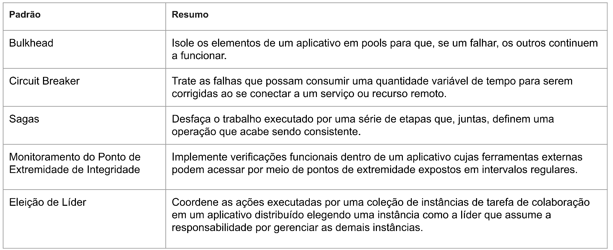
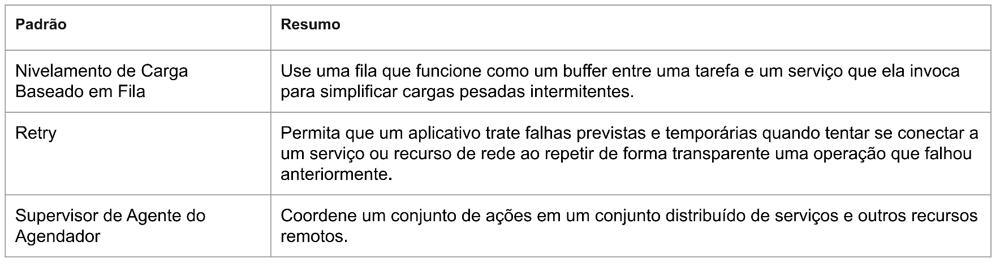
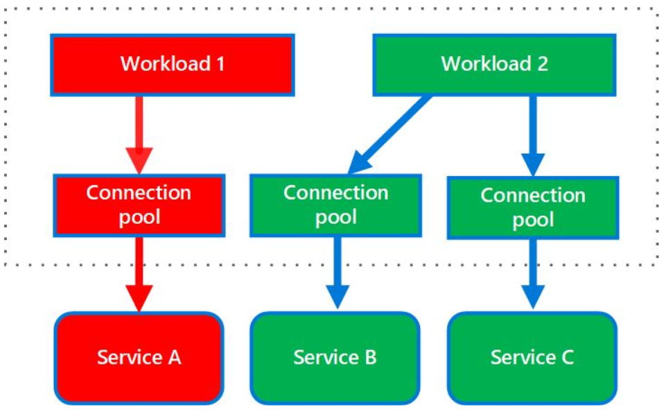
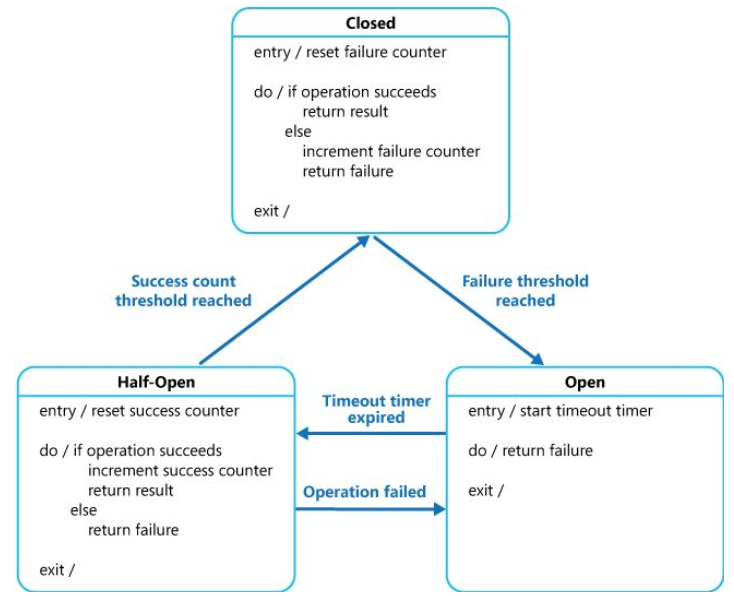
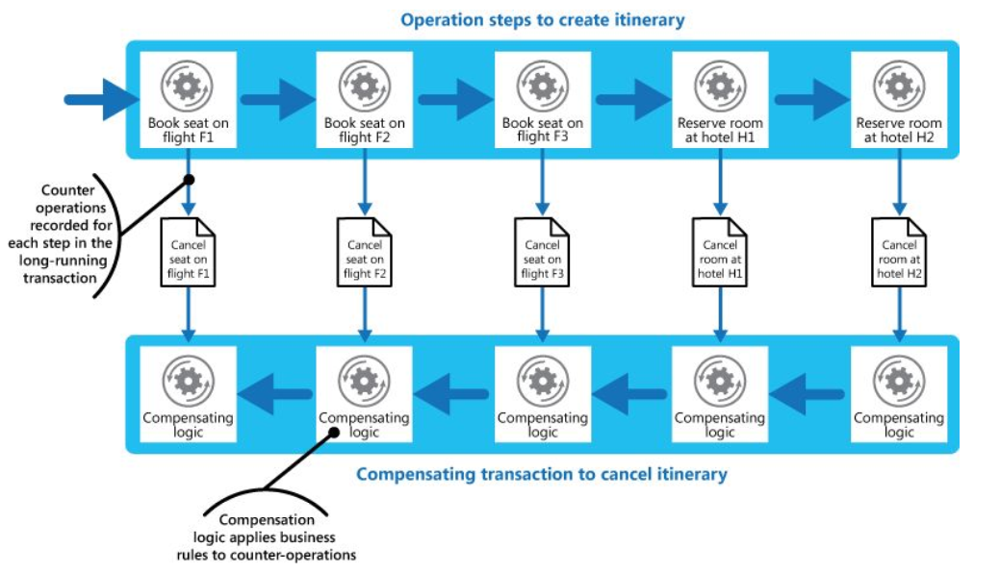
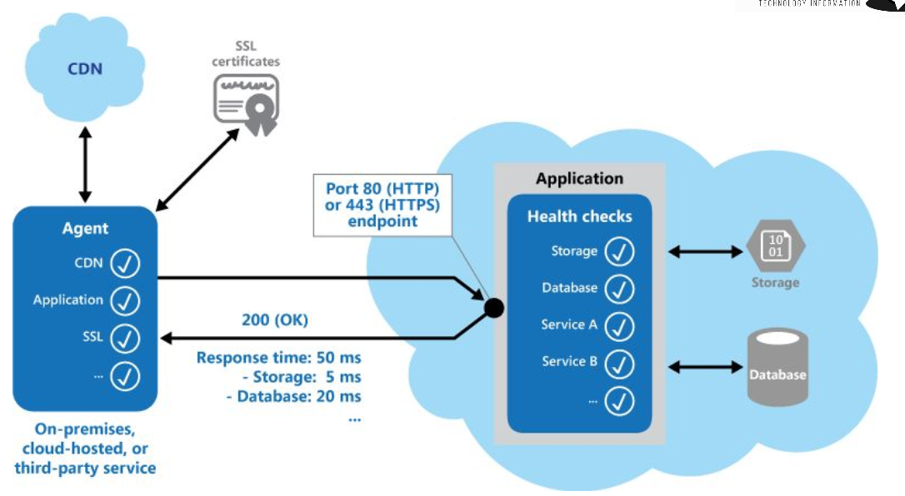
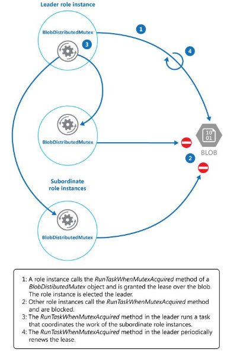
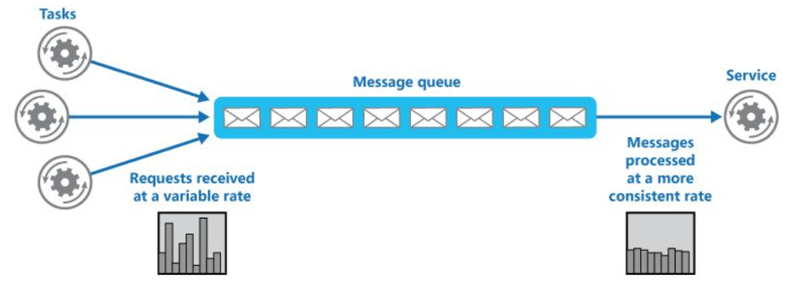
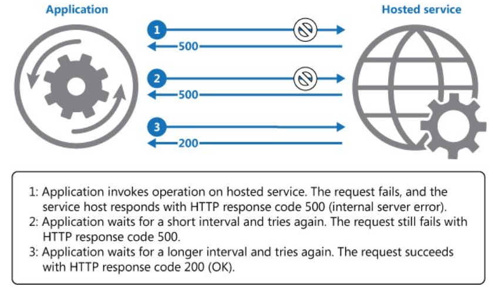
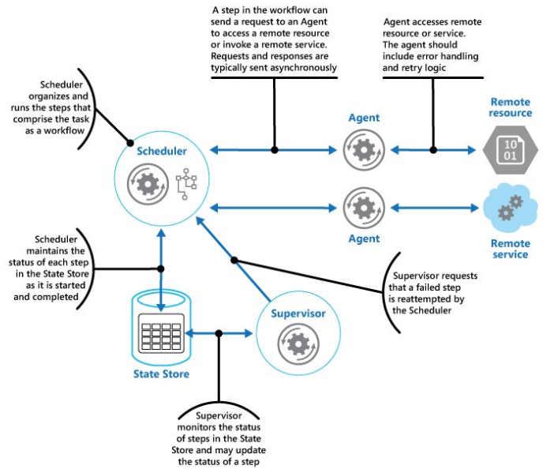

## Cloud Resilient;

> No mundo móvel e socialmente conectado de hoje, os usuários esperam conectar onde e quando quiserem, através de várias plataformas de acesso e vários locais.
>
> Qualquer tolerância restante tempo de inatividade e perda de dados agora evaporou em face do mundo sempre ativo.
>
> Preso entre os dois extremos de baixo custo soluções de recuperação de desastres e replicação de alto custo, muitas organizações estão adotando modelos de nuvem como uma maneira mais  acessível para atender aos requisitos de recuperação rápida de sistemas e dados.
>
> A nuvem inegavelmente oferece um enorme potencial como forma de reduzir custos, aumentar a agilidade e reduzir os riscos.
>
> Mas falhar em corretamente planejar e implementar resiliência pode resultar em uma ação não intencional de aumento no risco geral da empresa.
>
> Muitos usuários de soluções em nuvem assumem a existência de um nível de disponibilidade contínua que talvez não seja necessariamente projetada em todos os serviços em nuvem.
>
> Dessa maneira, apenas porque existe o potencial de resiliência melhorada e mais ágil, isso não significa que a resiliência é automaticamente atingida simplesmente porque uma carga de trabalho foi migrada para a nuvem.
>
> Quando se trata de resiliência, a nuvem deve ser visualizada e avaliada como outro domínio da tecnologia - com requisitos de resiliência não-funcional a serem definidos, avaliados, medido e monitorados.

### Padrões de resiliência
 
>  

>  

### Bulkhead

> O padrão bulkhead é um tipo de design de aplicativo que é tolerante a falhas.
>
> Em uma arquitetura bulkhead, os elementos de um aplicativo são isolados em pools para que, se houver falha, os outros continuarão a funcionar.
>
> Ele é nomeado depois das partições (bulkheads) de um envoltória de remessa.
>
> Se o casco de um navio for comprometido, somente a seção danificada se encherá de água, impedindo que o navio afunde.
>
> Particione instâncias de serviço em grupos diferentes conforme a carga do consumidor e nos requisitos de disponibilidade.
> Esse design ajuda a isolar falhas e permite que você mantenha a funcionalidade do serviço para alguns clientes mesmo durante uma falha.
>
> Um consumidor também pode dividir os recursos para garantir que os recursos usados para chamar um serviço não afetem os recursos usados para chamar outro.
> 
> Por exemplo, um pool de conexão para cada serviço poderá ser atribuído a um consumidor que chame vários serviços. Se um serviço começar a falhar, isso afetará somente o pool de conexão atribuído a esse serviço, permitindo que o consumidor continue usando outros serviços.

>  

### Circuit Breaker

> Trate as falhas que possam consumir uma quantidade variável de tempo para serem recuperadas ao se conectar a um serviço ou recurso remoto. Isso pode melhorar a estabilidade e a resiliência de um aplicativo.
> 
> O padrão de Disjuntor popularizado por Michael Nygard em seu livro Release It!, pode impedir que um aplicativo tente executar repetidamente uma operação em que a falha é provável. Ele permite continuar sem aguardar que a falha seja corrigida ou sem desperdiçar ciclos de CPU enquanto determina-se que a falha é de longa duração. O padrão de Disjuntor também permite que um aplicativo detecta se a falha foi resolvida. Se o problema aparentar ter sido corrigido, o aplicativo poderá tentar invocar a operação.
> 
> A finalidade do padrão de Disjuntor é diferente do padrão de Repetição. O padrão de Repetição permite que um aplicativo tente novamente uma operação na expectativa que haverá êxito. O padrão de Disjuntor impede que um aplicativo tente execute uma operação em que a falha é provável. Um aplicativo pode combinar esses dois padrões usando o padrão de repetição para invocar uma operação por meio de um disjuntor. No entanto, a lógica de repetição deverá ser sensível às exceções retornadas pelo disjuntor e abandonar as novas tentativas se o disjuntor indicar que uma falha não é transitória.
>
> Um disjuntor atua como um proxy para operações que podem falhar. O proxy deve monitorar o número de falhas recentes ocorridas e usar essas informações para decidir se deve permitir que a operação continue ou apenas retornar uma exceção imediatamente.

>  

### Sagas

> Desfaça o trabalho executado por uma série de etapas, que juntas definem uma operação eventualmente consistente, se uma ou mais das etapas falhar. As operações que seguem o modelo de consistência eventual geralmente normalmente são encontradas em aplicativos hospedados em nuvem que implementam fluxos de trabalho e processos de negócios complexos.
>
> As etapas em uma transação de compensação devem desfazer os efeitos das etapas na operação original. Uma transação de compensação não poderá simplesmente substituir o estado atual pelo estado em que o sistema estava no início da operação porque essa abordagem poderia substituir as alterações feitas por outras instâncias simultâneas de um aplicativo.
>
> Esse processo geralmente será específico do aplicativo, acompanhando a natureza do trabalho realizado pela operação original.
>
> Uma abordagem comum é usar um fluxo de trabalho para implementar uma operação eventualmente consistente que exige compensação.
> 
> À medida que a operação original prossegue, o sistema registra informações sobre cada etapa e como o trabalho executado pela etapa pode ser desfeito. Se a operação falhar em qualquer ponto, o fluxo de trabalho retrocede as etapas concluídas e executa o trabalho que reverte cada etapa. Observe que uma transação de compensação pode não precisar desfazer o trabalho na ordem inversa exata da operação original e pode ser possível realizar algumas das etapas de reversão em paralelo.

> 

### Padrão de monitoramento do ponto de extremidade de integridade

> Implemente verificações funcionais dentro de um aplicativo cujas ferramentas externas podem acessar por meio de pontos de extremidade expostos em intervalos regulares.
>
> Isso pode ajudar a verificar se os aplicativos e serviços estão funcionando corretamente.
> Implementar monitoramento de integridade, enviando solicitações para um ponto de extremidade no aplicativo. O aplicativo deve realizar as verificações necessárias e retornar uma indicação de seu status.
>
> Uma verificação de monitoramento de integridade geralmente combina dois fatores:
>    * As verificações (se houver) realizadas pelo aplicativo ou serviço em resposta à solicitação para o ponto de extremidade de verificação de integridade.
>    * Análise dos resultados pela ferramenta ou estrutura que executa a verificação de integridade.
>
> O código de resposta indica o status do aplicativo e, opcionalmente, quaisquer componentes ou serviços utilizados por ele.
>
> A verificação de tempo resposta ou latência é realizada pela estrutura ou ferramenta de monitoramento. A figura fornece uma visão geral do padrão.

> 

### Padrão de eleição de líder

> Coordene as ações executadas por uma coleção de instâncias de colaboração em um aplicativo distribuído elegendo uma instância como o líder que assume a responsabilidade de gerenciar as demais. Isso pode ajudar a garantir que as instâncias não entrem em conflito com outras, causar contenção de recursos compartilhados ou interferir inadvertidamente no trabalho que outras instâncias estão executando.
>
> Uma única instância de tarefa deve ser eleita para atuar como líder e essa instância deve coordenar as ações de outras instâncias de tarefa subordinada.
>
> Se todas as instâncias de tarefa executarem o mesmo código, qualquer uma delas poderá atuar como o líder. Portanto, o processo de eleição deve ser gerenciado com cuidado para evitar que duas ou mais instâncias assumam a função de líder ao mesmo tempo.
> 
> O sistema deve fornecer um mecanismo robusto para selecionar o líder. Esse método precisa lidar com eventos como interrupções da rede ou falhas de processo. Em muitas soluções, as instâncias de tarefa subordinadas monitoram o líder por meio de algum tipo de método de pulsação ou por meio de sondagem. Se o líder designado terminar inesperadamente ou se uma falha de rede deixar o líder indisponível para as instâncias de tarefa subordinadas, será necessário eleger um novo líder.
> Há várias estratégias para eleger o líder entre um conjunto de tarefas em um ambiente distribuído, incluindo:
> 
> Selecionar a instância da tarefa com a ID de processo ou instância mais baixa.
> 
> Corrida para adquirir um mutex compartilhado e distribuído.
>
> A primeira instância de tarefa que adquirir o mutex é o líder. No entanto, o sistema deve garantir que, se o líder for encerrado ou desconectado do restante do sistema, o mutex será liberado para permitir que outra instância de tarefa torne-se o líder.
>
> Implementação de um dos algoritmos comuns de eleição de líder, como o Algoritmo Bully ou Algoritmo Ring. Esses algoritmos presumem que cada candidato na eleição tem uma ID exclusiva e que ele pode se comunicar com os outros candidatos de maneira confiável.

> 

### Padrão de nivelamento de carga baseado em fila

> Use uma fila que funcione como um buffer entre uma tarefa e um serviço que ela invoca para simplificar sobrecargas intermitentes que podem causar falha no serviço ou a fazer a tarefa atingir o tempo limite. Isso pode ajudar a minimizar o impacto dos picos de demanda sobre a disponibilidade e a capacidade de resposta para a tarefa e o serviço.
>
> Refatore a solução e introduza uma fila entre a tarefa e o serviço.
>
> A tarefa e o serviço são executados de maneira assíncrona. A tarefa envia uma mensagem que contém os dados exigidos pelo serviço a uma fila. A fila atua como um buffer, armazenando a mensagem até que ela seja recuperada pelo serviço. O serviço recupera as mensagens da fila e as processa.
>
> Solicitações de várias tarefas, que podem ser geradas a uma taxa altamente variável, podem ser passadas para o serviço pela mesma fila de mensagens.
> Esta figura mostra o uso de uma fila para nivelar a carga em um serviço.

> 

### Retry

> Na nuvem, as falhas transitórias não são incomuns e um aplicativo deve ser criado para lidar com elas com elegância e transparência. Isso minimiza os efeitos que as falhas podem ter sobre as tarefas comerciais que o aplicativo está executando.
>
> Se um aplicativo detectar uma falha ao tentar enviar uma solicitação para um serviço remoto, ele poderá lidar com falhas usando as seguintes estratégias:
>   * Cancelar. Se a falha indica não ser transitória ou provavelmente não será bem-sucedida se for repetida, o aplicativo deve cancelar a operação e relatar uma exceção.
>   * Por exemplo, uma falha de autenticação causada pelo fornecimento de credenciais inválidas provavelmente não será bem-sucedida, independentemente de quantas tentativas ocorram.
>   * Tentar novamente. Se a falha específica relatada é incomum ou rara, ela pode ter sido causada por circunstâncias ncomuns, como um pacote de rede se tornar corrompido enquanto estava sendo transmitido. Nesse caso, o aplicativo pode repetir a solicitação com falha novamente imediatamente porque é improvável que a mesma falha se repita e a solicitação provavelmente será bem-sucedida.
>   * Tentar novamente após atraso. Se a falha é causada por uma ou mais falhas comuns de conectividade ou ocupado, a rede ou o serviço podem precisar de um breve período enquanto os problemas de conectividade são corrigidos ou a lista de pendências de trabalho é limpa. O aplicativo deve esperar por um tempo adequado antes de tentar executar novamente a solicitação.
>
> Para falhas transitórias mais comuns, o período entre as repetições deve ser escolhido para distribuir solicitações de várias instâncias do aplicativo de maneira mais uniforme possível. Isso reduz a chance de um serviço ocupado continuar a ser sobrecarregado. Se muitas instâncias de um aplicativo sobrecarregam continuamente um serviço com solicitações de novas tentativas, demorará mais para o serviço se recuperar.

> 

### Padrão de supervisor de agente do Agendador

> Coordene um conjunto de ações distribuídas como uma única operação. Se qualquer uma das ações falhar, tente tratar as falhas de forma transparente ou então desfaça o trabalho que foi executado para que toda a operação tenha êxito ou falhe como um todo. Isso pode adicionar resiliência a um sistema distribuído, permitindo que se recupere e tente novamente as ações que falharem devido a exceções transitórias, falhas de longa duração e falhas do processo.
>
> O _Agendador_ providencia as etapas que compõem a tarefa a ser executada e coordena a operação. Essas etapas podem ser combinadas em um pipeline ou fluxo de trabalho. O Agendador é responsável por garantir que as etapas nesse fluxo de trabalho sejam executadas na ordem correta. À medida que cada etapa é executada, o Agendador registra o estado do fluxo de trabalho, como "etapa ainda não iniciada", "etapa em execução" ou "etapa concluída". As informações de estado também devem incluir um limite máximo de tempo permitido para a conclusão da etapa, chamado de tempo de conclusão. Se uma etapa requer acesso a um serviço ou recurso remoto, o Agendador invocar o agente apropriado, passando os detalhes do trabalho a ser executado. O Agendador normalmente se comunica com um Agente usando mensagens de solicitação/resposta assíncronas. Isso pode ser implementado usando filas, embora outras tecnologias de mensagens distribuídas possam ser usadas em vez disso.
>   * O Agente contém a lógica que encapsula uma chamada para um serviço remoto ou o acesso a um recurso remoto referenciado por uma etapa em uma tarefa. Cada Agente normalmente encapsula chamadas para um único serviço ou recurso, implementando a lógica de lidar com erros e tentar novamente (sujeito a uma restrição de tempo limite, descrita posteriormente). Se as etapas no fluxo de trabalho sendo executadas pelo Agendador usam vários serviços e recursos entre etapas diferentes, cada etapa pode fazer referência a um Agente diferente (esse é um detalhe de implementação do padrão).
>   * O Supervisor monitora o status das etapas da tarefa que está sendo executada pelo Agendador. Ele é executado periodicamente (a frequência será específica do sistema) e examina o status das etapas mantidas pelo Agendador. Se ele detectar algum que tenha expirado ou falhado, providenciará que o Agente apropriado recupere a etapa ou execute a ação corretiva apropriada (isso pode envolver a modificação do status de uma etapa). Observe que a recuperação ou as ações corretivas são implementadas pelo Agendador e os Agentes. O Supervisor deve simplesmente solicitar que essas ações sejam executadas.

> 