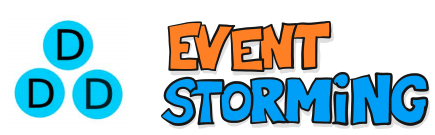
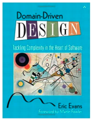
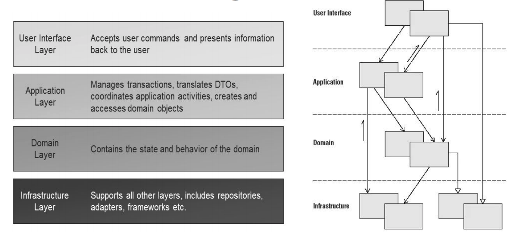
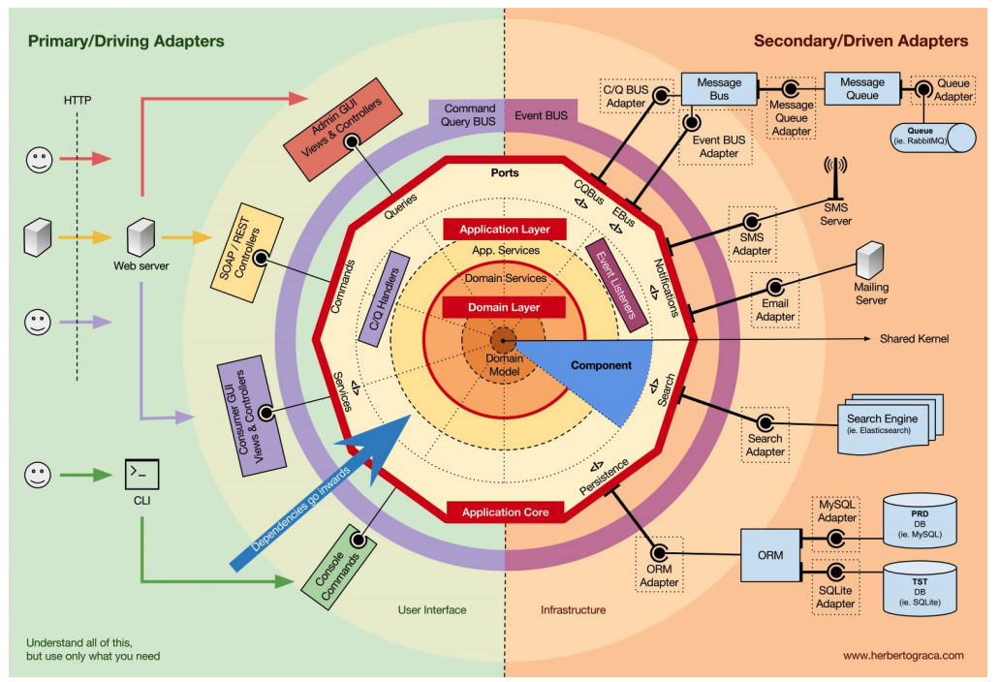

## O que é;

> Fundamentado na experiência de mais de 20 anos de Eric Evans no desenvolvimento de sistemas, o DDD é uma abordagem que reúne um conjunto de boas práticas, padrões, ferramentas e recursos da orientação a objetos que têm como objetivo a construção e  desenvolvimento de sistemas de acordo com o domínio e regras de negócio do cliente.
>
> Além disso, questões relacionadas ao processo de desenvolvimento, como a necessidade de um estreito relacionamento entre a equipe de programadores e os especialistas do domínio, também  são tratadas pela abordagem.

 

### Domain Driven Design

> Fundamentado na experiência de mais de 20 anos de Eric Evans no desenvolvimento de sistemas, o DDD é uma abordagem que reúne um conjunto de boas práticas, padrões, ferramentas e recursos da orientação a objetos que têm como objetivo a construção e desenvolvimento de sistemas de acordo com o domínio e regras de negócio do cliente.
>
>Além disso, questões relacionadas ao processo de desenvolvimento, como a necessidade de um estreito relacionamento entre a equipe de programadores e os especialistas do domínio, também são tratadas pela abordagem.

 

>   * O principal conceito do DDD é o modelo.
>   * O modelo expressa o domínio e negócio do cliente e pode ser criado utilizando desenhos, fluxogramas, diagramas, etc.
>   * O importante é que ele represente o negócio do cliente.
>   * Como principais componentes do DDD, podemos listar: a linguagem onipresente, a arquitetura em camadas e os padrões.
>   * É uma abordagem de desenvolvimento de software que reúne um conjunto de conceitos, princípios e técnicas cujo foco está no domínio e na lógica do domínio com o objetivo de criar um Domain Model ou (modelo do domínio).
>   * Significa desenvolver software de acordo com o domínio relacionado ao problema que estamos propondo resolver.
>   * O foco da abordagem é criar um domínio que “fale a língua” do usuário usando o que é conhecido como linguagem Ubíqua(ubiquitous language ou linguagem Comum,Onipresente).
>   * Linguagem Ubíqua (linguagem comum) entende-se que ao trabalhar com DDD devemos conversar usando uma mesma língua, em um único modelo, de forma que o mesmo seja compreendido pelo cliente, analista, projetista, desenhista, testador, gerente, etc. nesta linguagem, que seria a linguagem usada no dia a dia.

### Domain Driven Design - Camadas 

 

### Domain Driven Design - Modelo 

> O modelo é evolutivo: A cada iteração entre especialistas de domínio e a equipe técnica, o modelo se torna mais profundo e expressivo, mais rico, e os desenvolvedores transferem essa fonte de valor para o software.
>
> Assim, o modelo vai sendo gradualmente enriquecido com o expertise dos especialistas do domínio destilado pelos desenvolvedores, fazendo com que o time ganhe cada vez mais insight sobre o negócio e que esse conhecimento seja transferido para o modelo (para o código) através dos blocos de construção do DDD.
>
> Quando novas regras de negócio são adicionadas e/ou regras existentes são alteradas ou removidas, a implementação é refatorada para refletir essas alterações do modelo no código.
>
> No final, o modelo (que em última instância será o software) vai expressar com riqueza de conhecimento o negócio.

### Modelo DDD Com Arquitetura Hexagonal e Layered

 

### Quais as vantagens em usar DDD ?

>   1. O código fica menos acoplado e mais coeso.
>   2. O negócio é melhor compreendido por todos da equipe o que facilita o desenvolvimento.
>   3. Alinhamento do código com o negócio.
>   4. Favorecer reutilização.
>   5. Mínimo de acoplamento.
>   6. Independência da Tecnologia.

### DDD e Event Storming

>   * Event Storming é uma técnica de design rápido que engaja especialistas do domínio de negócios com desenvolvedores para que alcancem um ciclo rápido de aprendizagem (aprender o máximo possível no menor tempo possível.
>   Segundo Martin Flowler - Bounded Context (Contexto limitado) é um padrão central no design orientado a domínio.
>   É o foco da seção de design estratégico da DDD que trata de lidar com grandes modelos e equipes. O DDD lida com modelos grandes, dividindo-os em diferentes contextos limitados e sendo explícito sobre suas inter-relações.
>   *   Para encontrar os comandos, agregações e boundarys usaremos o conceito de Evento Storming.
>   *   Event Storming é uma técnica de design rápido que engaja especialistas do domínio de negócios com desenvolvedores para que alcancem um ciclo rápido de aprendizagem (aprender o máximo possível no menor tempo possível.
>
> Etapas:
>   * Mapeando os Eventos
>   * Identificando os Comandos
>   * Associando os Aggregates
>   * Delimitando as Fronteiras do Modelo e
>   * Identificando Domínios de Negócio